# DevFlow — GitHub Integrated Sprint & Project Management System

DevFlow is a modern, collaborative, production-grade project management SaaS platform designed specifically for agile software engineering teams. Unifying features of **Jira**, **GitHub Projects**, **Linear**, and **Trello**, DevFlow connects directly with your GitHub development workflow to eliminate context switching, synchronize task statuses, and provide multi-dimensional analytics.

---

## 1. Project Overview

### Project Introduction
DevFlow bridges the gap between codebase activity and sprint progress. In typical software projects, developers update tasks on a Kanban board (such as Jira) and separately push code, open pull requests, and close issues on GitHub. DevFlow integrates these activities. By connecting GitHub repositories to projects, sprint tasks are automatically linked to GitHub commits, pull requests, issues, and releases.

### Real-World Problem Statement
Modern software engineering teams suffer from *tool fragmentation*. A developer's lifecycle is split across:
1. **Sprint Management Tools** (e.g., Jira, Linear) to track sprint velocity, backlogs, and subtasks.
2. **Version Control Systems** (e.g., GitHub) to manage code, branch states, and pull requests.
3. **Collaboration Workspaces** (e.g., Slack, Discord) to monitor changes.

This fragmentation results in:
* **Stale Board Status**: Tasks remain in `IN_PROGRESS` or `REVIEW` long after the PR is merged because developers forget to update the board.
* **Manual Synchronization Overhead**: Scrum Masters spend hours cross-referencing GitHub commits and issues to construct sprint burndown charts.
* **Lack of Insights**: Development productivity metrics are decoupled from sprint goals, making it difficult to analyze velocity bottlenecks.

### Target Users
* **Software Engineers**: Seek a single workspace where code pushes and PR states automatically update their sprint tasks.
* **Scrum Masters & Project Managers**: Require real-time sprint burndown charts, velocity tracking, and accurate task status updates.
* **Engineering Managers & Directors**: Need unified dashboards displaying commit history, pull request trends, and team productivity metrics.
* **Viewers/Stakeholders**: Require read-only access to board progress and release analytics.

### Business Value
* **25% Increase in Developer Velocity**: Removes manual task updates and constant context switching.
* **Zero-Configuration Status Sync**: Automated webhook tracking maps pull request merges to task updates (`REVIEW` to `DONE`).
* **Enhanced Agile Visibility**: High-fidelity burndown charts capture scope creep and sprint bottlenecks immediately.

### Key Objectives
* Provide secure **GitHub OAuth** with a double-token (JWT + HttpOnly Cookie) security pattern.
* Implement a robust **Kanban Board** with drag-and-drop UI (`@hello-pangea/dnd`) synchronized in real time via **Socket.io**.
* Build a reliable **GitHub Webhook Engine** supporting HMAC-SHA256 signature verification and parsing events (`push`, `pull_request`, `issues`, `issue_comment`, `release`).
* Formulate **Sprint Analytics** using MongoDB aggregation pipelines to render burndown tracking, productivity rates, commit frequency, and PR trends.

### Market Differentiation
| Metric / Feature | Jira | GitHub Projects | Linear | DevFlow |
| :--- | :--- | :--- | :--- | :--- |
| **Real-time Collaboration** | Polling-based | Page Refresh | High latency | **Instant Socket-driven** |
| **Code-to-Task Mapping** | Manual integration | Local only | Semi-integrated | **Automatic Webhook Engine** |
| **Analytics Engine** | Static reports | Basic charts | Add-on paid | **Built-in Interactive charts** |
| **OAuth Experience** | Complex setup | Native only | Custom OAuth | **Seamless GitHub Passport OAuth** |

---

## 2. System Architecture

DevFlow is designed around a decoupled, event-driven client-server model that utilizes REST APIs for CRUD operations and WebSockets (Socket.io) for real-time collaboration.

### 2.1. System Context Diagram
Shows how actors interact with DevFlow and external systems.

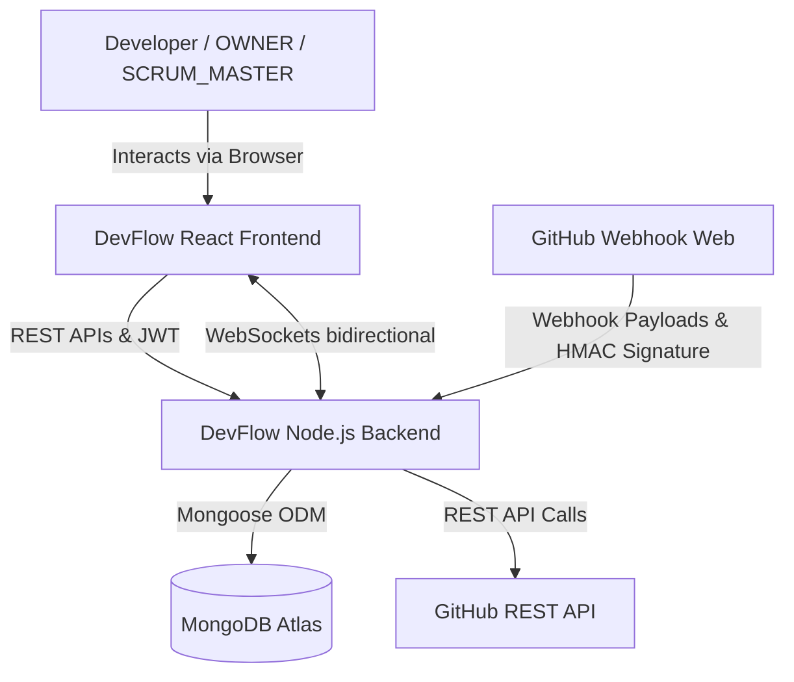

### 2.2. Component Diagram
Shows the logical components inside the frontend and backend applications.

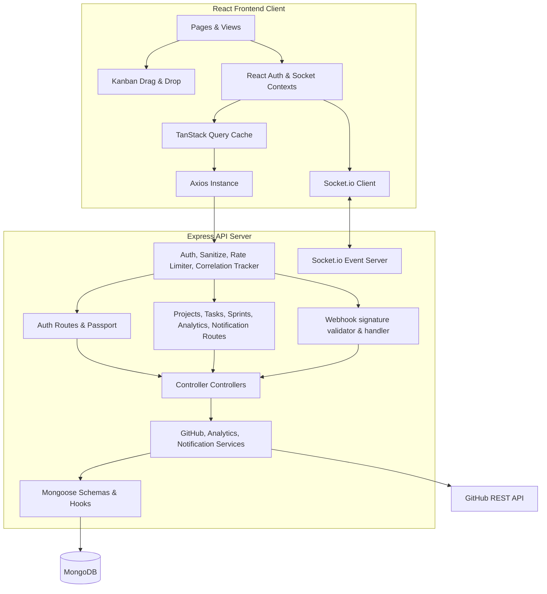

### 2.3. Deployment Diagram
Illustrates how the production build is mapped to cloud architecture.

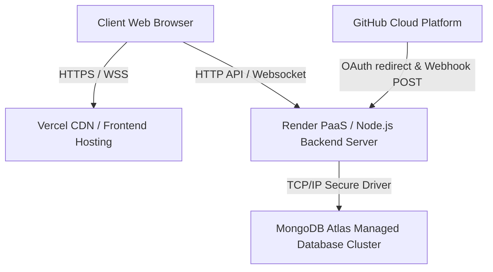

### 2.4. Package Diagram
Shows the directory dependencies and code organization.

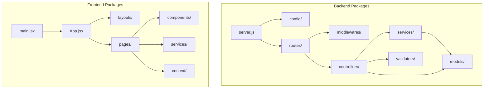

### 2.5. Request Lifecycle
1. **Request Reception**: Request hits Nginx/Render layer, which parses HTTPS and attaches HTTP headers.
2. **Correlation ID Generation**: `requestTracker` middleware generates a unique transaction UUID (`req.correlationId`).
3. **Security Check (Helmet & CORS)**: Helmet restricts headers; CORS validates origin and allows credentials.
4. **Rate Limiting**: `express-rate-limit` validates IP window.
5. **Input Sanitization**: Request bodies, queries, and params are sanitized against MongoDB Query Injection and XSS strings.
6. **Authentication & Project Scope Auth**:
   * Token verified by `protectRoute`. User attached to `req.user`.
   * Project routes load the project space using `requireProjectRole`, verifying the member exists and attaching `req.project` and `req.projectRole`.
7. **Controller Routing**: Maps to the controller, which executes business logic, invokes GitHub services, or modifies database documents.
8. **Real-time Broadcast**: If a database document changes, Socket.io broadcasts the update to the specific project room.
9. **Unified Response**: Controller sends a JSON payload wrapped in a standard envelope. In case of failure, the global error middleware formats the error and prints it with the correlation ID.

---

## 3. Complete Feature Breakdown

### 3.1. GitHub OAuth Login & User Profile Creation
* **Purpose**: Allows users to log in securely with their GitHub identity, creating a local DevFlow profile.
* **User Flow**: User clicks "Sign in with GitHub", redirects to GitHub OAuth, authorizes scopes, and redirects to `/oauth-callback` on the frontend with access tokens.
* **Backend Flow**: Passport exchange code for tokens, fetches profile, creates or updates the `User` model, creates a `GitHubIntegration` record, generates JWT tokens, and sets the Refresh Token in a secure HttpOnly cookie.
* **Database Interactions**: Checks `User` by `githubId`, saves `User`, upserts `GitHubIntegration` with access token.
* **Security**: Client credentials stored in environment variables; HttpOnly refresh token prevents token-stealing script attacks.
* **Edge Cases**: No email linked to GitHub profile (handled by defaulting to empty string).
* **Scalability**: Stateless JWT verifies client identity without database sessions.

### 3.2. Project Workspace & Invite Members (RBAC)
* **Purpose**: Creates isolated workspace containers for sprints, tasks, and members.
* **User Flow**: OWNER clicks "New Project", types name/description, invites members by username, and assigns role (`SCRUM_MASTER`, `DEVELOPER`, `VIEWER`).
* **Backend Flow**: Validates fields, saves project, updates member array.
* **Database Interactions**: Inserts `Project` document; queries `User` collection to locate invited members.
* **Security**: `requireProjectRole` middleware limits edit rights to `OWNER` or `SCRUM_MASTER`.
* **Edge Cases**: Inviting a user that doesn't exist (returns 404 validation error).
* **Scalability**: Indexed project lists by `members.userId` for fast user overview queries.

### 3.3. Repository Mapping & Synchronization
* **Purpose**: Maps GitHub repositories directly to a DevFlow project.
* **User Flow**: User navigates to project settings, lists their repositories, selects one, and clicks "Connect".
* **Backend Flow**: Uses OAuth token from `GitHubIntegration` to fetch details, inserts a `Repository` record, and updates the `Project`'s repo array.
* **Database Interactions**: Inserts `Repository` document, updates `Project`.
* **Security**: Decouples API credentials from client. GitHub API keys are held server-side.
* **Edge Cases**: GitHub API rate limits (handled via try-catch and status logging).
* **Scalability**: Caching repository stats so subsequent views do not hit GitHub API limits.

### 3.4. Agile Sprint Planning & Velocity Tracker
* **Purpose**: Creates time-boxed sprint containers with story points, start/end dates, and status.
* **User Flow**: Scrum Master creates a sprint, adds tasks, and clicks "Start Sprint" when ready.
* **Backend Flow**: Validates dates, shifts sprint status from `PLANNED` to `ACTIVE`. Only one sprint can be active per project.
* **Database Interactions**: Inserts/updates `Sprint`. Sets status to `ACTIVE`.
* **Security**: Locked to role `SCRUM_MASTER` or `OWNER` using `requireProjectRole`.
* **Edge Cases**: Double active sprints (validates on startup, returns error if an active sprint already exists).
* **Scalability**: Compound indexes optimize sprint fetches by `projectId` + `status`.

### 3.5. Interactive Kanban Board with Drag-and-Drop
* **Purpose**: Visual interface to track task state progression.
* **User Flow**: Developer grabs task card, drags from `TODO` to `IN_PROGRESS`, and releases.
* **Backend Flow**: Updates `status` of the task card, logs action, and triggers real-time socket events.
* **Database Interactions**: Updates `Task` by `_id`.
* **Security**: Developers can only modify tasks they are assigned or if they are Scrum Masters/Owners.
* **Edge Cases**: Dragging task while offline (handles client-side state rollback).
* **Scalability**: Optimistic UI updates on frontend with TanStack Query.

### 3.6. Real-time Live Collaboration Feed (Socket.io)
* **Purpose**: Ensures multiple users working on the same board see instant updates.
* **User Flow**: User updates a task, other online members see card move immediately without refreshing.
* **Backend Flow**: Broadcasts changes to room named `projectId`.
* **Database Interactions**: None (handled purely in-memory via WebSocket connections).
* **Security**: Handshake verifies user's JWT token.
* **Edge Cases**: Connection loss (handles automated client reconnect).
* **Scalability**: Maps user presence in-memory rather than hitting DB constantly.

### 3.7. GitHub Webhook Listener & Automatic Activity Logger
* **Purpose**: Integrates external repository events (commits, PRs) directly into the DevFlow sprint feed.
* **User Flow**: Developer commits code or merges PR on GitHub. Feed updates automatically.
* **Backend Flow**: Verifies HMAC-SHA256 signature, logs event under `Activity`, and emits socket payload.
* **Database Interactions**: Inserts `Activity` document.
* **Security**: Rejects payloads with missing or invalid signature headers.
* **Edge Cases**: Untracked webhook event (ignores silently, returns 200).
* **Scalability**: Asynchronous activity logs do not block request lifecycle.

### 3.8. KPI Cards & Multi-Dimensional Analytics Dashboard
* **Purpose**: Provides sprint performance, burn-downs, and commit metrics.
* **User Flow**: User clicks Analytics to see burndown charts, PR distributions, and commit frequency.
* **Backend Flow**: MongoDB aggregation pipelines process task states, story points, and commit timestamps.
* **Database Interactions**: Heavy aggregate reads on `Task` and `Activity` collections.
* **Security**: Restricts analytics views to project members.
* **Edge Cases**: Empty sprint (returns flatlined burndown gracefully).
* **Scalability**: Aggregations use indexed fields (`projectId`, `sprintId`) to reduce query scan times.

### 3.9. Push/Pull Request/Issue/Comment Activity Tracking
* **Purpose**: Maps GitHub actions to the project activity feed.
* **User Flow**: Commits are detailed on the activity page with author avatar and branch name.
* **Backend Flow**: Parses JSON webhook body and constructs action sentences.
* **Database Interactions**: Saves to `Activity`.
* **Security**: Strict checking of repository ownership.
* **Edge Cases**: GitHub webhook payload sizing exceed limits (capped at 10kb body parser limit).
* **Scalability**: Compound index on `project` + `createdAt` (descending) for fast feed listing.

### 3.10. Dynamic Real-time Slide-out Notification Center
* **Purpose**: Alerts users on task assignments, sprint triggers, and PR activities.
* **User Flow**: User sees drawer badge increment and slide-out toast when assigned a task.
* **Backend Flow**: Saves notification in database and emits to specific socket room `user-${userId}`.
* **Database Interactions**: Inserts `Notification`, updates `read` boolean.
* **Security**: Users can only retrieve their own notifications.
* **Edge Cases**: Triggering notification to self (suppressed in service).
* **Scalability**: Batch update endpoints mark notifications as read to avoid multiple round-trips.

---

## 4. Authentication & Authorization

DevFlow uses a double-token (AccessToken + RefreshToken) state management flow.

### 4.1. Sequence Diagram: Authentication Flow

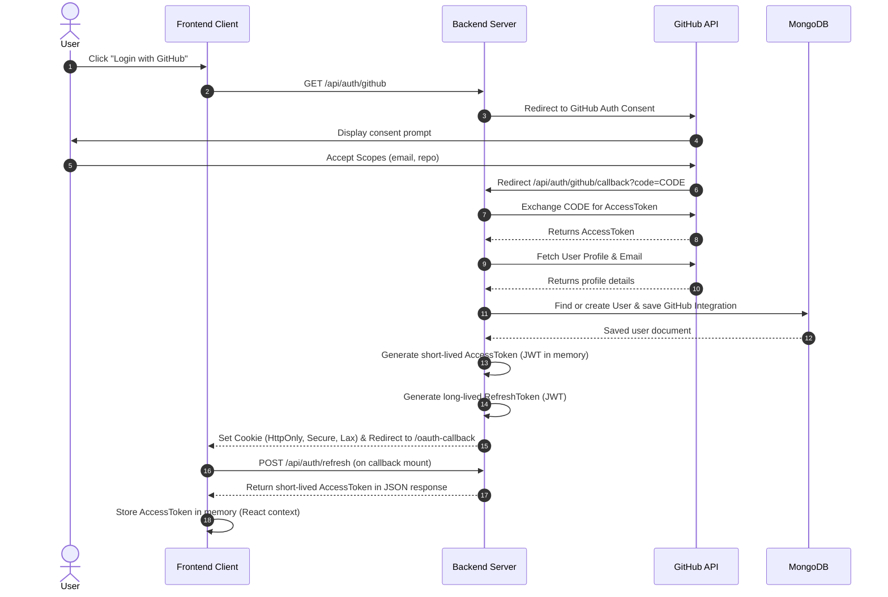

### 4.2. Role-Based Access Control (RBAC) & Permissions

DevFlow enforces permissions at both the system and project levels.

#### Permissions Matrix

| Permission | System OWNER | Project OWNER | SCRUM_MASTER | DEVELOPER | VIEWER |
| :--- | :---: | :---: | :---: | :---: | :---: |
| **Manage Users & Settings** | Yes | No | No | No | No |
| **Delete Project** | Yes | Yes | No | No | No |
| **Manage Sprints** | Yes | Yes | Yes | No | No |
| **Assign Tasks** | Yes | Yes | Yes | No | No |
| **Edit Backlog Tasks** | Yes | Yes | Yes | Yes | No |
| **Update Assigned Task Status** | Yes | Yes | Yes | Yes (Assigned only) | No |
| **View Project Board** | Yes | Yes | Yes | Yes | Yes |

#### Permission Validation Flow
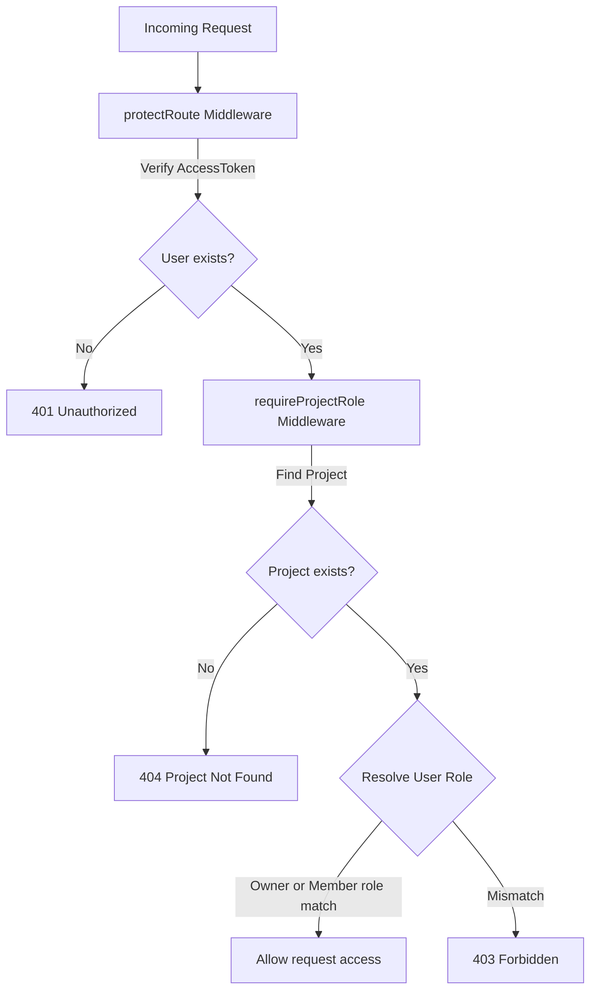

---

## 5. Database Design

MongoDB Atlas serves as the primary operational datastore. Data modeling is handled by Mongoose to ensure schema integrity.

### 5.1. Entity-Relationship (ER) Diagram

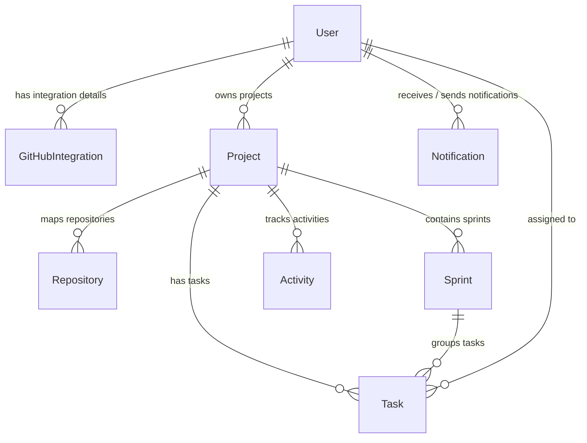

### 5.2. Mongoose Collections Schema Definition

#### Users Collection (`users`)
* **Purpose**: Stores system profiles created during GitHub OAuth.
* **Fields**:
  * `githubId` (String, required, unique, indexed): The user's GitHub ID.
  * `username` (String, required, trimmed): GitHub login name.
  * `email` (String, lowercased, trimmed): Primary contact email.
  * `avatar` (String): URL pointing to GitHub profile photo.
  * `role` (String, Enum: `OWNER`, `SCRUM_MASTER`, `DEVELOPER`, `VIEWER`): System default role.
* **Indexes**: `{ githubId: 1 }` (unique).

#### Projects Collection (`projects`)
* **Purpose**: Scopes workspaces for developers and linked components.
* **Fields**:
  * `name` (String, required, trimmed): Display title.
  * `description` (String, default: empty): Text description.
  * `owner` (ObjectId -> User, required, indexed): Project owner.
  * `members` (Array of sub-documents):
    * `userId` (ObjectId -> User, required)
    * `role` (String, Enum: `OWNER`, `SCRUM_MASTER`, `DEVELOPER`, `VIEWER`)
  * `repositories` (Array of ObjectId -> Repository): Connected GitHub repos.
  * `status` (String, Enum: `ACTIVE`, `ARCHIVED`, default: `ACTIVE`, indexed).
* **Indexes**:
  * `{ owner: 1 }`
  * `{ 'members.userId': 1 }`
  * `{ status: 1 }`

#### Repositories Collection (`repositories`)
* **Purpose**: Holds details of connected GitHub repositories.
* **Fields**:
  * `githubRepoId` (String, required, unique, indexed): GitHub repository ID.
  * `name` (String, required): Repo name.
  * `owner` (String, required): Repository owner organization or username.
  * `url` (String, required): Direct link.
  * `defaultBranch` (String, default: `main`): Default branch name.
  * `projectId` (ObjectId -> Project, indexed): Project mapped.
  * `starsCount` (Number, default: 0)
  * `forksCount` (Number, default: 0)
  * `openIssuesCount` (Number, default: 0)
  * `contributorsCount` (Number, default: 0)
  * `contributors` (Array):
    * `username` (String)
    * `avatar` (String)
    * `contributions` (Number)
  * `latestCommit` (Sub-document):
    * `sha` (String), `message` (String), `authorName` (String), `authorAvatar` (String), `date` (Date)
  * `syncedAt` (Date).
* **Indexes**: `{ githubRepoId: 1 }` (unique), `{ projectId: 1 }`.

#### Sprints Collection (`sprints`)
* **Purpose**: Groups work items into time-boxed iterations.
* **Fields**:
  * `projectId` (ObjectId -> Project, required, indexed)
  * `name` (String, required): Sprint title.
  * `goal` (String): Sprint focus.
  * `startDate` (Date, required)
  * `endDate` (Date, required)
  * `status` (String, Enum: `PLANNED`, `ACTIVE`, `COMPLETED`, default: `PLANNED`, indexed)
  * `velocity` (Number, default: 0): Velocity achieved upon completion.
* **Indexes**: `{ projectId: 1, status: 1 }`.

#### Tasks Collection (`tasks`)
* **Purpose**: Represents individual issue cards on the Kanban board.
* **Fields**:
  * `projectId` (ObjectId -> Project, required, indexed)
  * `sprintId` (ObjectId -> Sprint, indexed)
  * `title` (String, required, trimmed)
  * `description` (String, default: empty)
  * `status` (String, Enum: `BACKLOG`, `TODO`, `IN_PROGRESS`, `REVIEW`, `DONE`, default: `BACKLOG`, indexed)
  * `priority` (String, Enum: `LOW`, `MEDIUM`, `HIGH`, `CRITICAL`, default: `MEDIUM`)
  * `assignee` (ObjectId -> User, indexed)
  * `githubIssueNumber` (Number): Optional link to GitHub issue.
  * `estimatedHours` (Number, default: 0)
  * `completedHours` (Number, default: 0)
  * `storyPoints` (Number, default: 0)
* **Indexes**: `{ projectId: 1, sprintId: 1, status: 1, assignee: 1 }`.

#### Activities Collection (`activities`)
* **Purpose**: Tracks project events for audit trails and notification streams.
* **Fields**:
  * `user` (ObjectId -> User, optional): Author of action (null if automated github webhook).
  * `project` (ObjectId -> Project, required, indexed)
  * `action` (String, required): Event description.
  * `metadata` (Mixed): JSON block containing hashes, branches, URL, title.
* **Indexes**: `{ project: 1, createdAt: -1 }`.

#### GitHubIntegrations Collection (`githubintegrations`)
* **Purpose**: Securely stores access tokens for GitHub API requests.
* **Fields**:
  * `userId` (ObjectId -> User, required, unique, indexed)
  * `accessToken` (String, required): GitHub OAuth user token.
  * `refreshToken` (String): Refresh token.
  * `connectedAt` (Date).
* **Indexes**: `{ userId: 1 }` (unique).

#### Notifications Collection (`notifications`)
* **Purpose**: Stores alerts for user notifications.
* **Fields**:
  * `recipient` (ObjectId -> User, required, indexed)
  * `sender` (ObjectId -> User, required)
  * `project` (ObjectId -> Project, indexed)
  * `type` (String, Enum: `TASK_ASSIGNED`, `TASK_COMPLETED`, `SPRINT_STARTED`, `PR_OPENED`, required)
  * `title` (String, required)
  * `message` (String, required)
  * `link` (String): Redirect action page.
  * `read` (Boolean, default: false).
* **Indexes**: `{ recipient: 1 }`.

---

## 6. API Documentation

### 6.1. Authentication Endpoints

#### `GET /api/auth/github`
* **Purpose**: Initiates GitHub OAuth authentication flow.
* **Authentication**: None.
* **Query Parameters**: None.
* **Request Body**: None.
* **Success Response**: Redirects browser to GitHub.
* **Error Response**: `500 Internal Server Error` if client keys are misconfigured.

#### `GET /api/auth/github/callback`
* **Purpose**: Callback endpoint for GitHub to redirect with authentication authorization code.
* **Authentication**: None.
* **Success Response**: Redirects to `${FRONTEND_URL}/oauth-callback` and sets `refreshToken` in HttpOnly cookie.

#### `POST /api/auth/refresh`
* **Purpose**: Issues a new short-lived JSON Web Token (JWT) using the refresh cookie.
* **Authentication**: Secure HttpOnly Cookie `refreshToken`.
* **Request Body**: None.
* **Success Response**:
  * **Code**: `200 OK`
  * **Body**:
    ```json
    {
      "success": true,
      "accessToken": "eyJhbGciOi...",
      "user": {
        "_id": "603d2e1b12...",
        "username": "octocat",
        "email": "octo@github.com",
        "avatar": "https://...",
        "role": "DEVELOPER"
      }
    }
    ```
* **Error Response**: `401 Unauthorized` if refresh token is missing, expired, or invalid.

#### `POST /api/auth/logout`
* **Purpose**: Clears the refresh token cookie and logs the user out.
* **Authentication**: None.
* **Success Response**: `200 OK` with cookie cleared.

#### `GET /api/auth/me`
* **Purpose**: Retrieves details of the currently logged-in user.
* **Authentication**: Bearer Token in `Authorization` Header.
* **Success Response**:
  * **Code**: `200 OK`
  * **Body**:
    ```json
    {
      "success": true,
      "user": {
        "_id": "603d2...",
        "username": "octocat",
        "role": "OWNER"
      }
    }
    ```

---

### 6.2. Project Endpoints

#### `GET /api/projects`
* **Purpose**: Lists all projects the logged-in user owns or is a member of.
* **Authentication**: Bearer Token.
* **Success Response**:
  * **Code**: `200 OK`
  * **Body**:
    ```json
    {
      "success": true,
      "projects": [
        {
          "_id": "603d...",
          "name": "DevFlow Platform",
          "description": "MERN sprint tracking tool",
          "owner": "603d...",
          "status": "ACTIVE",
          "members": []
        }
      ]
    }
    ```

#### `POST /api/projects`
* **Purpose**: Creates a new project workspace.
* **Authentication**: Bearer Token.
* **Request Body**:
  ```json
  {
    "name": "DevFlow API",
    "description": "Node API backend services"
  }
  ```
* **Validation**: Name must be between 3 and 50 characters, description max 500 characters.
* **Success Response**: `201 Created` with project document.

#### `POST /api/projects/:projectId/members`
* **Purpose**: Invites a user to a project workspace.
* **Authentication**: Bearer Token (Project OWNER or SCRUM_MASTER only).
* **Request Body**:
  ```json
  {
    "username": "john_doe",
    "role": "DEVELOPER"
  }
  ```
* **Validation**: Role must be one of `OWNER`, `SCRUM_MASTER`, `DEVELOPER`, `VIEWER`.
* **Success Response**: `200 OK` with updated project member list.

---

### 6.3. Sprint Endpoints

#### `GET /api/projects/:projectId/sprints`
* **Purpose**: Fetches sprints within a project.
* **Authentication**: Bearer Token (Project Member).
* **Success Response**: `200 OK` list of sprints.

#### `POST /api/projects/:projectId/sprints`
* **Purpose**: Creates a new sprint.
* **Authentication**: Bearer Token (Project OWNER or SCRUM_MASTER).
* **Request Body**:
  ```json
  {
    "name": "Sprint 1 - Authentication",
    "goal": "Implement GitHub OAuth and login flow",
    "startDate": "2026-06-25T00:00:00.000Z",
    "endDate": "2026-07-09T00:00:00.000Z"
  }
  ```
* **Validation**: End date must be after start date.
* **Success Response**: `201 Created`.

#### `PATCH /api/sprints/:id`
* **Purpose**: Updates sprint status (e.g. starts or completes sprint).
* **Authentication**: Bearer Token (Project OWNER or SCRUM_MASTER).
* **Request Body**:
  ```json
  {
    "status": "ACTIVE"
  }
  ```
* **Success Response**: `200 OK` updated sprint.

---

### 6.4. Task Endpoints

#### `GET /api/projects/:projectId/tasks`
* **Purpose**: Fetches tasks linked to a project.
* **Authentication**: Bearer Token.
* **Success Response**: `200 OK` list of tasks.

#### `POST /api/projects/:projectId/tasks`
* **Purpose**: Creates a new task.
* **Authentication**: Bearer Token.
* **Request Body**:
  ```json
  {
    "title": "Setup Helmet Security",
    "description": "Configure helmet protection middleware",
    "sprintId": "603d...",
    "priority": "HIGH",
    "storyPoints": 3,
    "status": "TODO"
  }
  ```
* **Success Response**: `201 Created` task details.

#### `PUT /api/tasks/:id`
* **Purpose**: Updates task details (e.g. priority, status, description).
* **Authentication**: Bearer Token.
* **Request Body**:
  ```json
  {
    "status": "IN_PROGRESS",
    "assignee": "603d2..."
  }
  ```
* **Success Response**: `200 OK` updated task.

---

### 6.5. Webhooks, Analytics & Notifications

#### `POST /api/webhooks/github`
* **Purpose**: Captures real-time repository actions pushed from GitHub.
* **Authentication**: Verification of `X-Hub-Signature-256` header against Webhook Secret.
* **Success Response**: `200 OK` with verification confirmation.

#### `GET /api/analytics/projects/:projectId`
* **Purpose**: Fetches aggregation data for analytics dashboards.
* **Authentication**: Bearer Token.
* **Success Response**: `200 OK` with KPIs and charts dataset.

#### `GET /api/notifications`
* **Purpose**: Lists unread notification alerts.
* **Authentication**: Bearer Token.
* **Success Response**: `200 OK` list of notifications.

---

## 7. GitHub Integration Flow

DevFlow integrates with the GitHub ecosystem by connecting user accounts, mapping repositories, and listening for real-time code updates.

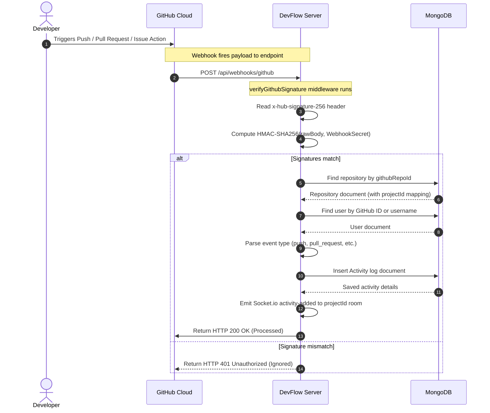

### Signature Verification Details
Webhooks use a shared webhook secret key. The middleware computes signature checks using a secure timing-safe equality utility:
```javascript
const hmac = crypto.createHmac('sha256', secret);
const digest = `sha256=${hmac.update(payload).digest('hex')}`;
const signatureBuffer = Buffer.from(signature);
const digestBuffer = Buffer.from(digest);
if (!crypto.timingSafeEqual(signatureBuffer, digestBuffer)) {
  // Reject request
}
```

---

## 8. Sprint & Kanban Workflow

Agile delivery lifecycle transitions through planned states and board modifications.

### 8.1. State Transitions

* **Planned**: Sprints are created in a backlog stage. Tasks are assigned to the sprint.
* **Active**: Starting a sprint opens the Kanban board.
* **Completed**: Finishing a sprint freezes modifications. Completed tasks stay in `DONE`. Incomplete tasks roll back into the project `BACKLOG` to be rescheduled. Velocity points are computed from total completed story points.

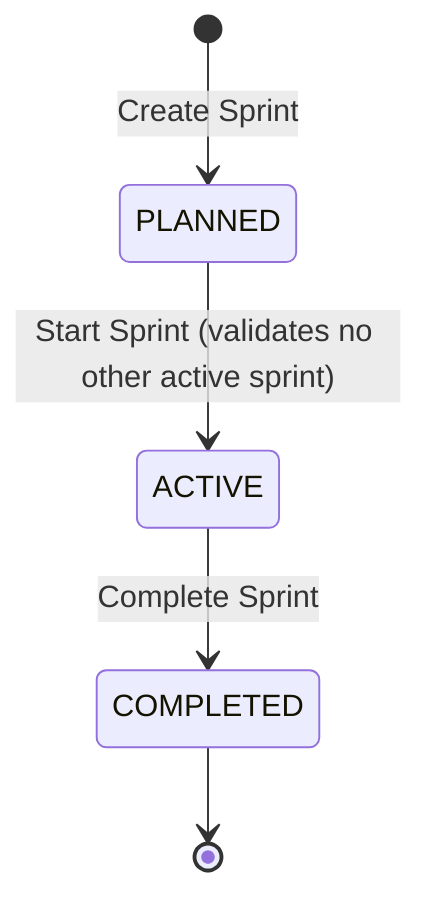

### 8.2. Kanban Task Transitions

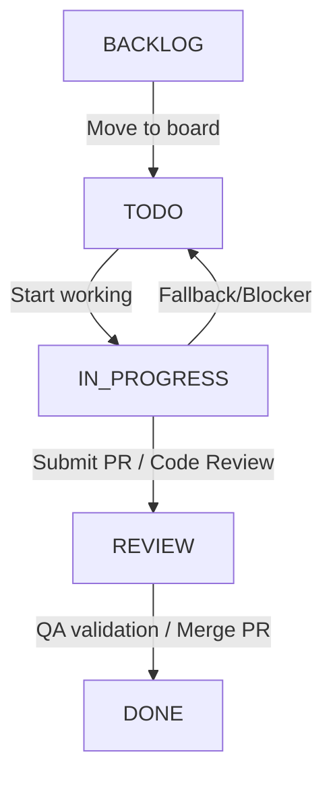

### 8.3. Burndown Chart Aggregate Pipeline
Burndown calculations compute the remaining story points over the sprint timeline.
* **Ideal Burn Line**: Linear decline from the sum of all story points at start date to 0 at end date.
* **Actual Burn Line**: Computed by subtracting the story points of tasks moved to `DONE` from the total sprint points on each calendar day of the active period.

---

## 9. Real-Time Architecture

The real-time collaboration engine uses WebSockets (Socket.io) to synchronize workspaces across multiple active clients.

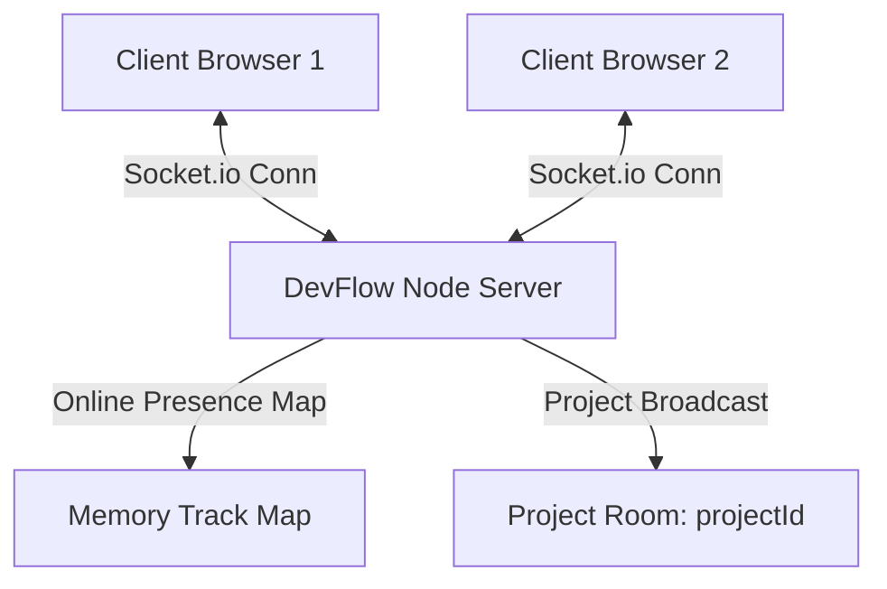

### Socket Event Lifecycle
1. **Handshake Auth**: Client passes JWT Token in the connection parameters. Server decodes JWT and rejects unauthorized connections.
2. **Room Registration**: Client sends `join-project` event with `projectId`. Server adds socket to room and updates the user presence list.
3. **Event Propagation**:
   * When a task changes state on the Kanban board, the client sends a socket event (or calls the REST API, which triggers a socket emission).
   * Server catches event and broadcasts a payload to all sockets in the `projectId` room except the sender.
4. **Presence Management**: When a client disconnects, the server removes the user from the presence list and broadcasts the updated online user count.

---

## 10. Security Architecture

DevFlow is designed around the **OWASP Top 10** guidelines to ensure enterprise-grade security.

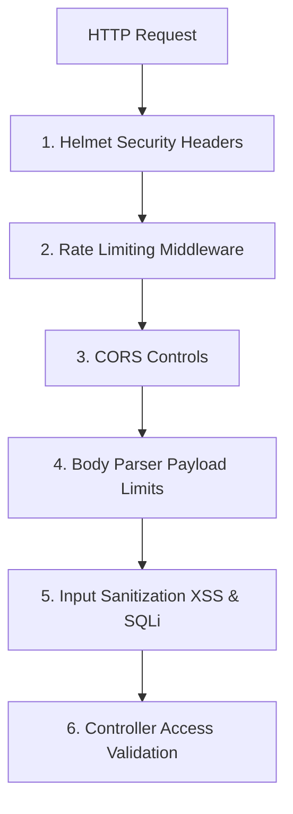

### 10.1. Implemented Security Controls

* **Secure Authentication**:
  * Double-token model: Access Token (JWT, short-lived in-memory) + Refresh Token (JWT, long-lived secure cookie).
  * Cookie settings: `httpOnly: true`, `secure: true` (production), `sameSite: 'lax'`, `maxAge: 7 days`.
* **Helmet Headers**: Configures security headers to prevent Cross-Site Scripting (XSS), Clickjacking, and MIME Sniffing.
* **Mongo Query Sanitization**: Middleware scans payload objects and strips keys starting with `$` or `.` to prevent NoSQL injection attacks.
* **CORS Policy Configuration**: Origin is restricted to the specific frontend URL with credentials authorization allowed.
* **API Rate Limiting**: Limit API requests to 100 per 15 minutes per IP address to prevent brute-force attacks.
* **Input Validation & Sanitization**: Express validators sanitize parameters, and HTML escape tags filter text inputs to prevent persistent XSS attacks.

---

## 11. Scalability Considerations

To support high concurrent user loads, DevFlow's architecture is designed to scale horizontally.

* **Stateless API Design**: The application server stores no session state, allowing requests to be routed across any node instance.
* **Database Scaling**:
  * Compound indexing on fields like `{ projectId: 1, status: 1 }` prevents full collection scans.
  * MongoDB Atlas handles write distribution and read-replicas.
* **Real-time Event Scaling**: Connects Socket.io to a Redis Adapter to sync websocket events across multiple Node.js instances.
* **Task Queues**: Heavy synchronization operations (like syncing repository data or loading historical commit logs) can be offloaded to background task runner queues (such as BullMQ or RabbitMQ) to keep API response times low.

---

## 12. Folder Structure Deep Dive

```
DevFlow/
├── .github/
│   └── workflows/
│       └── ci.yml               # GitHub Actions CI suite pipeline
├── docker-compose.yml           # Local multi-container Docker config
├── backend/
│   ├── Dockerfile               # Node server container build file
│   ├── package.json             # Backend dependencies and run scripts
│   ├── server.js                # API entry point & server setup
│   ├── config/                  # App configurations
│   │   ├── db.js                # MongoDB connection handler
│   │   ├── passport.js          # Passport GitHub OAuth Strategy
│   │   └── socket.js            # Socket.io room management
│   ├── controllers/             # Request handlers (MVC Controllers)
│   │   ├── authController.js    # Login, callback & token refresh
│   │   ├── projectController.js # Workspace creation, role assignments
│   │   ├── sprintController.js  # Sprint state machine transitions
│   │   ├── taskController.js    # Kanban card CRUD operations
│   │   ├── webhookController.js # GitHub Webhook verification
│   │   └── analyticsController.js # Analytics aggregates
│   ├── models/                  # Mongoose Schemas (Data layer)
│   ├── middlewares/             # Request pre-processors
│   │   ├── authMiddleware.js    # JWT validation
│   │   ├── projectAuth.js       # Project RBAC permission gate
│   │   ├── requestTracker.js    # Correlation ID generator
│   │   └── sanitizeMiddleware.js# NoSQL Injection & XSS prevention
│   ├── services/                # Business logic helper services
│   │   ├── github.service.js    # GitHub REST API integrations
│   │   ├── analyticsService.js  # Charts & stats aggregation pipeline
│   │   └── notificationService.js # Notification dispatcher
│   ├── utils/                   # Helpers & utilities
│   ├── validators/              # Input validation rules
│   └── __tests__/               # Vitest suite
└── frontend/
    ├── Dockerfile               # Vite build container script
    ├── nginx.conf               # Nginx server routing configurations
    ├── package.json             # Frontend dependencies
    ├── tailwind.config.js       # Tailwind CSS design system tokens
    ├── src/
        ├── App.jsx              # Main routing & app entry point
        ├── main.jsx             # React mount loader
        ├── index.css            # Base styles & Tailwind setup
        ├── assets/              # Static media assets
        ├── components/          # Reusable UI widgets
        ├── context/             # React states (Auth, Sockets)
        ├── layouts/             # Shared dashboard shell layout
        ├── pages/               # Top-level view routes
        └── services/            # Axios API client integrations
```

---

## 13. Design Patterns Used

* **Model-View-Controller (MVC)**: Decouples the data models (Mongoose), user view routing (React), and backend routers/controllers.
* **Service Layer Pattern**: Decouples business logic from HTTP controller contexts. Services like `github.service.js` handle API fetching, and `analyticsService.js` handles data aggregations.
* **Middleware Pattern**: Uses Express's middleware chain to intercept, audit, rate-limit, sanitize, and authenticate incoming requests before they hit the controller.
* **Observer Pattern**: Uses Socket.io to publish project updates to subscribing clients in real time.

---

## 14. Error Handling Strategy

DevFlow uses a centralized error-handling strategy to ensure that all API errors return clean, predictable responses.

### 14.1. The Standard Error Envelope
All API errors return a standard JSON object containing a `correlationId` to help developers track down issues in server logs:
```json
{
  "success": false,
  "message": "Project not found",
  "correlationId": "5f13acbe-9a3d-4c8d-bf8d-d60211a7bb50"
}
```

### 14.2. Request Logger & Correlation IDs
Every request is assigned a unique UUID in the `requestTracker` middleware:
```javascript
import { v4 as uuidv4 } from 'uuid';
req.correlationId = uuidv4();
```
When an error occurs, the server logs the error along with the correlation ID, and returns the ID in the API response. This allows developers to quickly trace errors in production logs.

---

## 15. Performance Optimization

* **Compound Indexing**: Schema indexes on task status, sprint ID, and project member IDs optimize common query paths and prevent full-collection scans in MongoDB.
* **TanStack Query Caching**: The frontend uses TanStack Query to cache API responses, reducing redundant network requests and providing a smoother user experience.
* **Selective Projections**: MongoDB queries use selective projections (e.g. `.select('_id username email avatar role')`) to fetch only the fields required for the operation, reducing network payload sizes.
* **Parallel API Requests**: The backend uses `Promise.all` to fetch data from the GitHub API, contributors list, and latest commits in parallel, decreasing response times.

---

## 16. CI/CD & Deployment

DevFlow is configured for containerized local development and automated deployment pipelines.

### 16.1. Deployment Architecture

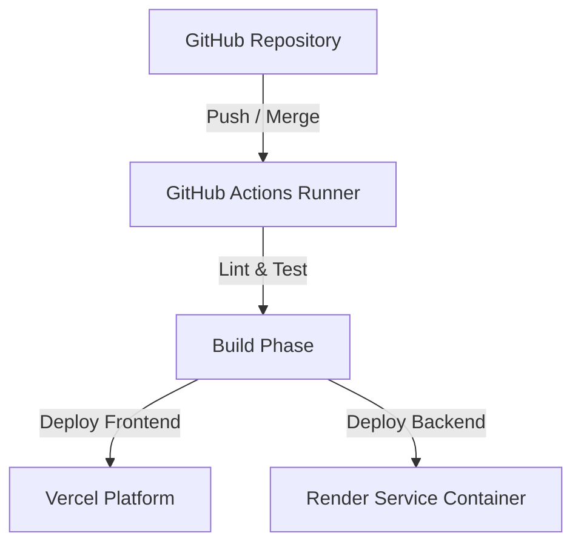

### 16.2. Docker Multi-Container Configuration
Run the entire application, including the database, locally using Docker Compose:
```bash
docker compose up -d --build
```
* **Frontend**: Runs at [http://localhost:80](http://localhost:80)
* **Backend**: Runs at [http://localhost:5000](http://localhost:5000)
* **MongoDB**: Runs locally on port `27017` with persistent volume storage.

### 16.3. Production Checklist
- [ ] Enforce HTTPS on Vercel and Render.
- [ ] Update `JWT_ACCESS_SECRET` and `JWT_REFRESH_SECRET` with strong, unique keys.
- [ ] Set `NODE_ENV` to `production` to enable secure cookies and disable detailed error stacks.
- [ ] Configure MongoDB IP access lists to restrict access only to the backend server.
- [ ] Register the production GitHub OAuth callback URL in your GitHub developer settings.

---

## 17. Testing Strategy

The test suite uses **Vitest** for backend unit and integration testing.

* **Unit Testing**: Tests individual components and helper functions in isolation.
* **Mocking Integration**: Uses Vitest's `vi.mock` to mock database models and Socket.io instances, ensuring tests run quickly without requiring active database connections.
* **Testing Command**: Run tests locally with the following command:
  ```bash
  cd backend
  npm test
  ```

---

## 18. Complete User Journey

The diagram below details the end-to-end user lifecycle, from initial GitHub registration to active sprint tracking.

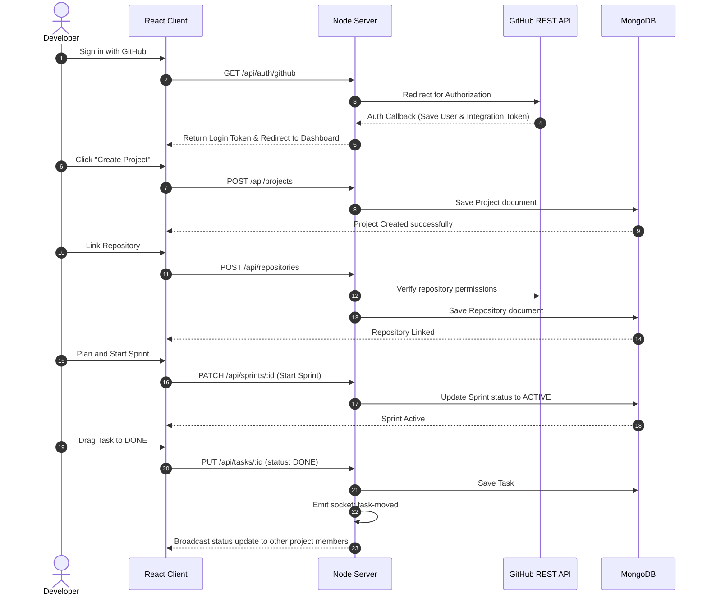

---

## 19. Interview Preparation Section

This section contains common interview questions and answers to help you prepare for technical discussions about DevFlow.

### 19.1. Beginner Interview Questions (20 Q&A)

#### 1. What is the MERN stack?
The MERN stack is a popular JavaScript web development stack consisting of **MongoDB** (database), **Express.js** (backend framework), **React** (frontend library), and **Node.js** (runtime environment).

#### 2. What is the difference between SQL and NoSQL?
SQL databases are relational, table-based databases with structured, predefined schemas. NoSQL databases (like MongoDB) are non-relational, document-oriented databases that use flexible, JSON-like document structures.

#### 3. How does Passport.js handle OAuth?
Passport.js uses modular authentication strategies. The GitHub strategy handles redirecting the user to GitHub's authorization page, retrieving the authorization code from the callback URL, and exchanging it for an access token to fetch the user's profile.

#### 4. What is a JWT and what are its parts?
A JSON Web Token (JWT) is a secure, compact way of transmitting information between parties as a JSON object. It consists of three parts separated by dots: the **Header** (token type and algorithm), the **Payload** (user claims and metadata), and the **Signature** (verifies the sender and token integrity).

#### 5. Why do we use cross-origin resource sharing (CORS)?
CORS is a browser security mechanism that restricts web pages from making requests to a different domain than the one that served the page. We configure CORS on the backend to allow authorized requests from our React frontend.

#### 6. What is the purpose of the `dotenv` package?
The `dotenv` package loads environment variables from a `.env` file into Node.js's `process.env` object, keeping sensitive credentials (like database connection strings and API keys) out of the codebase.

#### 7. What does the `verify` callback do in Passport configuration?
The `verify` callback is executed after GitHub authenticates the user. It receives the access token, refresh token, and user profile from GitHub, and allows the backend to find or create the user record in the database.

#### 8. What is the purpose of Mongoose in this stack?
Mongoose is an Object Data Modeling (ODM) library for MongoDB and Node.js. It provides schema validation, manages relationships between collections, and simplifies database queries.

#### 9. What is a socket room?
In Socket.io, rooms are arbitrary channels that sockets can join and leave. They are used to group connections (e.g. by `projectId`) so events can be targeted and broadcasted to specific groups of users.

#### 10. What is React Router client-side routing?
React Router enables navigation in a Single Page Application (SPA) without requiring full page reloads, updating the browser URL and rendering the corresponding React page component dynamically.

#### 11. What is TanStack Query (React Query)?
TanStack Query is a state-management library for React that simplifies fetching, caching, synchronizing, and updating server state in client applications.

#### 12. What does Helmet middleware do in Express?
Helmet sets secure HTTP headers (like Content Security Policy, XSS Protection, and Frame Options) to protect the Express application from common web vulnerabilities.

#### 13. What is an HttpOnly cookie?
An HttpOnly cookie is a cookie that cannot be accessed by client-side scripts (such as JavaScript's `document.cookie`). This protects tokens from Cross-Site Scripting (XSS) attacks.

#### 14. What are Git Webhooks?
GitHub Webhooks are automated HTTP POST payloads sent to a configured server URL when specific events (like pushes, issues, or pull requests) occur in a repository.

#### 15. What is the difference between a Task and a Bug?
In DevFlow, a task represents a standard work item on the Kanban board, while a bug tracks code defects. Both map to a Mongoose task document, with the priority and description indicating its type.

#### 16. What is a Git tag and how is it processed?
A Git tag is a reference point in a repository's history (often used for releases). When a release event webhook is received, the backend parses the tag name and adds a release event to the project's activity log.

#### 17. What are React 19 Context Providers?
Context Providers allow React applications to share state (like authentication status or WebSocket connections) globally across components without passing props down manually through every level of the tree.

#### 18. What is the role of the Nginx server in the Docker configuration?
Nginx acts as a web server to host the static React build files, configuring routing fallbacks so that React Router can handle URL navigation correctly.

#### 19. What is rate limiting?
Rate limiting restricts the number of requests an IP address can make to an API within a given timeframe, protecting the server from denial-of-service (DoS) attacks and brute-force attempts.

#### 20. What is the purpose of a Kanban backlog column?
The backlog column holds tasks that are planned but not yet scheduled for active development. Tasks are moved from the backlog to the active sprint board during sprint planning.

---

### 19.2. Intermediate Interview Questions (20 Q&A)

#### 1. Explain the double-token authentication strategy.
The double-token strategy balances security and user convenience:
* **Access Token**: Short-lived (e.g. 15 minutes) and stored in client memory. Used to authenticate API requests.
* **Refresh Token**: Long-lived (e.g. 7 days) and stored in a secure, HttpOnly cookie. Used to request a new access token when the current one expires.
This setup ensures that even if an access token is compromised, it is only valid for a short time, while keeping the long-lived token protected from client-side script theft.

#### 2. How do you implement Role-Based Access Control (RBAC) in Express routes?
RBAC is implemented using middleware functions that check the user's role before routing the request. For example, the `authorizeRole` middleware checks `req.user.role` against a list of allowed roles, returning a `403 Forbidden` error if the user does not have the required permissions.

#### 3. How does the `requireProjectRole` middleware work in DevFlow?
The `requireProjectRole` middleware validates user permissions within a specific project:
1. It extracts the `projectId` from request parameters.
2. It fetches the project from the database.
3. It checks whether the user is the project owner or a member with an authorized role.
4. If authorized, it attaches the project and the user's project role to the request object (`req.project` and `req.projectRole`) and calls `next()`.

#### 4. How do you verify GitHub Webhook signatures?
GitHub signs webhook payloads using a HMAC-SHA256 signature containing the payload body and a shared secret key. The backend verifies this signature using the raw request body:
```javascript
const hmac = crypto.createHmac('sha256', secret);
const digest = `sha256=${hmac.update(req.rawBody).digest('hex')}`;
```
It then compares the computed digest against the signature header using `crypto.timingSafeEqual` to prevent timing attacks.

#### 5. Why is `crypto.timingSafeEqual` used in signature verification?
Standard string comparisons stop checking at the first mismatched character, causing comparisons of similar strings to resolve faster than completely different ones. Attackers can analyze these differences to guess signatures character by character. `crypto.timingSafeEqual` runs in constant time, preventing these timing attacks.

#### 6. How does the Kanban board handle drag-and-drop state transitions?
The React frontend uses `@hello-pangea/dnd` to handle drag-and-drop interactions:
1. When a card is dropped, the `onDragEnd` handler receives source and destination columns.
2. The frontend updates its local state immediately for a responsive feel (optimistic UI update).
3. The frontend makes an API call to update the task status in the database.
4. The server receives the update, saves it, and broadcasts a `task-moved` event via Socket.io so other active clients see the move.

#### 7. How are incomplete tasks handled when a sprint is completed?
When a sprint status changes to `COMPLETED`, the server executes a transaction:
1. It updates the sprint status to `COMPLETED`.
2. It calculates the sprint's velocity based on the completed story points.
3. It finds all incomplete tasks in the sprint and resets their `sprintId` to `null` and their status to `BACKLOG`, returning them to the project backlog.

#### 8. How do you calculate a sprint's velocity?
Sprint velocity is calculated by summing the story points of all tasks that reached the `DONE` status during the sprint's active period.

#### 9. Explain how MongoDB compound indexes work.
Compound indexes index multiple fields within a single structure. For example, indexing tasks on `{ projectId: 1, sprintId: 1, status: 1 }` allows MongoDB to quickly resolve queries that filter tasks by project, sprint, and status using a single index scan.

#### 10. How do you handle database sanitization in Express?
We use middleware that recursively scans incoming request objects (`req.body`, `req.query`, `req.params`) and deletes keys that begin with `$` or `.`. This prevents NoSQL injection attacks where attackers use MongoDB operator keys to bypass query logic.

#### 11. Explain the flow of automatic token refreshes on the frontend.
The frontend uses Axios interceptors to handle expired access tokens automatically:
1. When an API request returns a `401 Unauthorized` error (indicating the access token has expired), the response interceptor pauses outgoing requests.
2. It makes a request to `/api/auth/refresh` to get a new access token.
3. If successful, it updates the access token in memory and retries the original failed request.
4. If token refresh fails, it clears the user session and redirects the user to the login page.

#### 12. How does the Activity model track GitHub webhook actions?
When the backend processes a GitHub webhook, it creates an `Activity` document:
* `user`: Maps to the User's ObjectId if the GitHub username matches a user in our database.
* `project`: Maps to the project connected to the repository.
* `action`: A text summary of the event (e.g. `"merged PR #42"`).
* `metadata`: Holds specific event details (like commit hashes, branch name, or URL).

#### 13. How does the Socket.io server authenticate connection requests?
The Socket.io initialization middleware intercepts incoming connections and reads the token from authentication handshakes:
```javascript
const token = socket.handshake.auth?.token;
const decoded = verifyAccessToken(token);
const user = await User.findById(decoded.id);
```
If the token is valid, the user object is attached to the socket (`socket.user = user`), allowing controllers to identify the sender of socket events.

#### 14. What are Mongoose model schemas, and why do we use timestamp fields?
Schemas define the fields, types, validators, and indexes for database collections. Setting `timestamps: true` in Mongoose automatically adds `createdAt` and `updatedAt` date fields to documents, which are used to generate the activity feed and sorting search results.

#### 15. How do you handle Nginx configuration for Single Page Applications (SPAs)?
In an SPA, routing is handled on the client side by React Router. If a user refreshes the page on a sub-route (like `/dashboard/projects`), the web server will return a 404 error because that file does not exist on the server. We configure Nginx to fallback to `index.html`:
```nginx
try_files $uri $uri/ /index.html;
```
This serves the React application bundle, which reads the URL and renders the correct view.

#### 16. What is the difference between unit and integration testing?
* **Unit Testing**: Verifies individual functions or components in isolation, mocking dependencies to ensure fast and reliable execution.
* **Integration Testing**: Verifies that different modules and services function correctly together (e.g. testing that a controller correctly invokes a service and saves changes to a database).

#### 17. How does the request logger middleware track response times?
The request logger records the start time when a request is received, and listens for Express's `finish` event on the response object to calculate the duration:
```javascript
const start = Date.now();
res.on('finish', () => {
  const duration = Date.now() - start;
  console.log(`${req.method} ${req.originalUrl} - ${res.statusCode} (${duration}ms)`);
});
```

#### 18. Why do we set payload size limits on Express body parsers?
By default, Node servers will accept incoming request payloads of any size. Attackers can exploit this by sending large request bodies to exhaust server memory and disk space. We restrict payload sizes using the body parser configuration:
```javascript
app.use(express.json({ limit: '10kb' }));
```

#### 19. How does DevFlow prevent Cross-Site Scripting (XSS) in inputs?
The application uses input sanitization middleware that runs on all incoming requests. The middleware sanitizes text inputs by converting HTML tag characters (like `<` and `>`) into safe character entities (like `&lt;` and `&gt;`), preventing browsers from executing malicious scripts injected into description or title fields.

#### 20. What is React's Concurrent rendering model, and how does it benefit DevFlow?
React 19 uses concurrent rendering features that allow the browser to prioritize user interactions (like dragging Kanban cards) over background rendering tasks, keeping the interface responsive even when rendering complex charts or heavy activity feeds.

---

### 19.3. Advanced System Design Questions (20 Q&A)

#### 1. Design a system to scale Socket.io to 100,000 concurrent users.
To scale Socket.io connections:
1. **Load Balancing**: Use an Application Load Balancer (ALB) with sticky sessions enabled to route client handshakes to the same backend server.
2. **Pub/Sub Broker**: Configure the Socket.io Redis Adapter to broadcast events across multiple server instances.
3. **Connection Tuning**: Increase the open files limit (`ulimit -n`) on server instances to support thousands of concurrent TCP sockets.
4. **Horizontal Scaling**: Run instances inside Docker containers managed by Kubernetes or AWS ECS, scaling containers dynamically based on CPU and memory utilization.

#### 2. How do you prevent race conditions when updating sprint story points?
To prevent race conditions (e.g. when two users modify task points simultaneously):
1. **Optimistic Locking**: Add a version key field (`__v`) to Mongoose schemas. Mongoose will check this version field before writing updates, rejecting the operation if another process has updated the document since it was fetched.
2. **Atomic Operators**: Use atomic MongoDB update operators like `$inc` and `$set` rather than loading, modifying, and saving documents in separate steps:
   ```javascript
   await Task.findByIdAndUpdate(taskId, { $set: { storyPoints: newPoints } });
   ```

#### 3. How do you handle GitHub API rate limits in a production SaaS?
To manage rate limits (5,000 requests per hour for authenticated OAuth users):
1. **Caching**: Store GitHub user profiles, repository statistics, and contributor lists in a Redis cache with a short TTL (e.g. 5 minutes).
2. **Conditional Requests**: Use HTTP caching headers like `ETag` and `If-None-Match`. The GitHub API returns a `304 Not Modified` status if data has not changed, which does not count against your rate limit.
3. **Queue Processing**: Offload non-urgent synchronization tasks to a background queue, spacing requests out to prevent spikes.

#### 4. Design a resilient Webhook processing queue that handles GitHub downtime.
If the backend server fails or restarts, webhooks may be lost. To prevent data loss:
1. **Ingress Layer**: Configure a lightweight webhook receiver that validates signatures and writes payloads directly to a message broker (like RabbitMQ or BullMQ).
2. **Worker Processing**: Run worker processes that consume webhooks from the queue and process database updates.
3. **Dead Letter Queue (DLQ)**: If a webhook fails to process, send it to a DLQ and configure retry logic with exponential backoff.

#### 5. How would you support multi-tenant data isolation?
To isolate data between different client organizations:
1. **Logical Isolation**: Add a tenant identifier field (e.g. `tenantId` or `organizationId`) to all collections, and configure middleware to append this tenant filter to all database queries.
2. **Database Isolation**: Create separate databases for each tenant, routing incoming requests to the tenant's database dynamically using middleware that inspects the request subdomain or header token.

#### 6. Explain how MongoDB Atlas handles sharding, and choose a shard key for tasks.
Sharding distributes database collections across multiple servers to scale write capacity. For the `tasks` collection, `projectId` is a good shard key because most queries are scoped to a specific project. This keeps all task data for a project on a single shard, avoiding slow cross-shard queries.

#### 7. How would you design an audit log system that is tamper-proof?
To build an immutable audit log:
1. **Append-Only collection**: Remove update and delete permissions on the audit log collection from the application's database user role.
2. **Cryptographic Chaining**: Link log entries cryptographically by storing the hash of the previous log entry in the current document (similar to a blockchain).
3. **External Archiving**: Stream logs in real time to write-once-read-many (WORM) storage like AWS S3 with Object Lock enabled.

#### 8. How do you prevent memory leaks in long-running Node.js Socket.io connections?
To avoid memory leaks:
1. **Cleanup Event Listeners**: Always remove event listeners when sockets disconnect:
   ```javascript
   socket.on('disconnect', () => {
     socket.removeAllListeners();
   });
   ```
2. **Evict Cache Records**: Periodically clear offline users from active project tracking maps.
3. **Monitor Heap Memory**: Set up monitoring tools (like Clinic.js or Prometheus) to trace memory consumption and identify leaks.

#### 9. What is Database Projection, and how does it optimize database read performance?
Projections restrict the database response to specific fields. For example, fetching project members only requires their usernames and avatars. Using projections avoids loading heavy descriptions or integration keys into server memory, reducing network payload sizes and memory consumption.

#### 10. Design a distributed lock manager for sprint status changes.
If multiple nodes attempt to start the same sprint simultaneously:
1. Use Redis to acquire a distributed lock using the Redlock algorithm:
   ```javascript
   const lock = await redlock.acquire([`locks:sprint:${sprintId}`], 5000);
   ```
2. Once the lock is acquired, perform the update and release the lock when complete. If the node fails, the lock expires automatically.

#### 11. How would you migrate a Mongoose database schema in production without downtime?
To perform schema migrations safely:
1. **Schema Flexibility**: Write application code that supports both the old and new schema designs simultaneously.
2. **Background Updates**: Run a migration script that updates documents in batches using background database processes to avoid locking collections.
3. **Remove Old Code**: Once all documents are migrated, deploy a new version of the application that only uses the updated schema structure.

#### 12. How does the Node event loop handle intensive calculations, and how do we protect it?
Node.js runs on a single thread. CPU-intensive operations (like processing charts or calculating analytics) can block the event loop, preventing the server from processing other incoming requests. We prevent this by offloading intensive operations to worker threads, using database aggregations, or running calculations in background worker processes.

#### 13. How does React 19 handle DOM rendering optimizations?
React 19 uses a virtual DOM to batch updates and calculate the minimum number of changes required before updating the browser's DOM, preventing layout thrashing and keeping animations smooth.

#### 14. Design an asset loading optimization strategy for the React frontend client.
To optimize loading times:
1. **Code Splitting**: Use `React.lazy` to load page views only when navigated to.
2. **CDN Distribution**: Upload built assets to a CDN (like Cloudflare or AWS CloudFront).
3. **Compression**: Configure the hosting server to compress assets using Gzip or Brotli.
4. **Cache Control Headers**: Set long cache-control headers on static assets to prevent browsers from downloading unchanged files.

#### 15. How would you implement database query pagination for the activity feed?
To handle large feeds, use cursor-based pagination:
1. The client requests the feed, passing the timestamp of the oldest visible activity as a cursor parameter.
2. The server queries the database for records older than the cursor:
   ```javascript
   Activity.find({ project: projectId, createdAt: { $lt: cursor } }).sort({ createdAt: -1 }).limit(20);
   ```
This avoids the performance issues of offset-based pagination (`.skip(1000)`), which requires MongoDB to scan all skipped documents.

#### 16. Explain the security trade-offs of storing JWTs in LocalStorage vs HttpOnly Cookies.
* **LocalStorage**: Vulnerable to Cross-Site Scripting (XSS) attacks. If an attacker runs a malicious script on the page, they can access the token.
* **HttpOnly Cookies**: Protected from client-side scripts. However, they are vulnerable to Cross-Site Request Forgery (CSRF) attacks, which we prevent by configuring strict CORS policies and setting the `SameSite: Lax` cookie attribute.

#### 17. How would you build a microservices architecture for DevFlow?
To split the monolith into microservices:
1. **Gateway**: Create an API Gateway to handle routing, rate limiting, and SSL termination.
2. **Auth Service**: A standalone service to manage user accounts, tokens, and OAuth flows.
3. **Sprint & Task Service**: Manages projects, boards, and tasks.
4. **Webhook Sync Service**: Handles incoming webhooks from GitHub.
5. **Analytics Service**: Computes metrics and reports.
Services communicate asynchronously using a message broker (like Kafka or RabbitMQ) and use internal REST or gRPC APIs for synchronous requests.

#### 18. How do you implement database transaction support in MongoDB?
We use MongoDB multi-document transactions to ensure data consistency across multiple collections:
```javascript
const session = await mongoose.startSession();
session.startTransaction();
try {
  await Sprint.updateOne({ _id: sprintId }, { status: 'COMPLETED' }, { session });
  await Task.updateMany({ sprintId, status: { $ne: 'DONE' } }, { sprintId: null, status: 'BACKLOG' }, { session });
  await session.commitTransaction();
} catch (error) {
  await session.abortTransaction();
  throw error;
} finally {
  session.endSession();
}
```

#### 19. How do you configure Docker files to minimize image sizes?
We use multi-stage Docker builds:
1. **Build Stage**: Install all dependencies (including devDependencies) and build frontend/backend assets.
2. **Production Stage**: Copy only the built assets and production dependencies into a lightweight base image (like Alpine Linux), reducing the final image size.

#### 20. How would you monitor production errors and server performance?
We configure monitoring tools:
* **Error Tracking**: Integration with Sentry to capture exception stack traces and link them to user sessions.
* **Performance Metrics**: Use Prometheus to collect server metrics (CPU usage, memory heap, response times) and render dashboards in Grafana.
* **Application Logs**: Stream logs to centralized logging systems (like Winston, ELK Stack, or Datadog).

---

### 19.4. Architecture Decision Questions (Why MongoDB, React, Node.js, OAuth, WebSockets)

#### Why MongoDB?
MongoDB's document-based model fits the hierarchical, flexible nature of agile project management data (projects, sprints, tasks). Sprints and task lists vary in structure, and MongoDB allows us to update schemas without run-time migration overhead. Its native support for aggregation pipelines allows us to calculate metrics (like burndowns) directly in the database.

#### Why React?
React's component architecture, state management, and virtual DOM enable us to build a fast, responsive user interface. Its rich ecosystem (including `@hello-pangea/dnd` and Recharts) provides the tools needed to build interactive Kanban boards and analytics dashboards.

#### Why Node.js?
Node.js uses an event-driven, non-blocking I/O model that is well-suited for I/O-intensive real-time applications like DevFlow. Sharing JavaScript across both the frontend and backend simplifies development and allows us to share validation rules (e.g. using Zod schemas).

#### Why GitHub OAuth?
Since DevFlow is built for software developers, integrating with GitHub profiles provides a seamless, secure onboarding experience. Storing the user's GitHub OAuth token allows the server to fetch repository details and sync commit history without requiring users to input API keys.

#### Why WebSockets?
WebSockets provide full-duplex, real-time communication channels over a single TCP connection. This allows us to sync the Kanban board and activity feed instantly across multiple client instances without the overhead of HTTP polling.

---

### 19.5. Security Questions (15 Q&A)

#### 1. How does DevFlow prevent NoSQL injection attacks?
We use input sanitization middleware that scans incoming request parameters and strips keys that start with `$` or `.`. This prevents attackers from injecting MongoDB operator keys (like `{"$gt": ""}`) to bypass query logic.

#### 2. What is Cross-Site Scripting (XSS), and how does DevFlow prevent it?
XSS occurs when an application renders untrusted data on a web page without proper sanitization, allowing malicious scripts to execute in the user's browser. DevFlow sanitizes all text inputs by escaping HTML characters, converting them into safe character entities (e.g. converting `<script>` to `&lt;script&gt;`).

#### 3. How does DevFlow protect session tokens from script-based theft?
DevFlow stores the access token in memory (React context) and the refresh token in an HttpOnly cookie. Because HttpOnly cookies cannot be accessed by client-side scripts, they are protected from XSS attacks.

#### 4. How does the application protect against Cross-Site Request Forgery (CSRF) attacks?
Because refresh tokens are stored in cookies, browsers will automatically append them to cross-origin requests. We protect against CSRF by:
1. Configuring strict CORS policies that only accept requests from our frontend domain.
2. Setting the `SameSite: Lax` attribute on our refresh cookie to prevent browsers from sending cookies on cross-origin requests.

#### 5. How does DevFlow secure sensitive credentials in production environments?
Sensitive credentials (like database connection strings, webhook secrets, and API client keys) are stored in environment variables on the hosting platform (Vercel and Render), keeping them out of source code repositories.

#### 6. What is the role of Helmet middleware in the security architecture?
Helmet sets secure HTTP response headers to restrict browser behavior:
* `Content-Security-Policy`: Restricts the sources of scripts, styles, and media assets.
* `X-Frame-Options`: Prevents clickjacking attacks by blocking the page from rendering in frames or iframes.
* `X-Content-Type-Options`: Blocks browsers from sniffing MIME types.

#### 7. How does DevFlow protect APIs from Denial of Service (DoS) attacks?
We configure rate-limiting middleware that tracks client IP addresses and limits them to 100 requests per 15 minutes. Requests exceeding this limit receive a `429 Too Many Requests` error, protecting the server from brute-force attempts and scraping bots.

#### 8. How do you secure data transmission between the client and server?
All production traffic is routed over HTTPS and WSS (WebSocket Secure), encrypting data in transit and protecting it from man-in-the-middle (MITM) attacks.

#### 9. How are user passwords stored in the database?
Since authentication is handled via GitHub OAuth, we do not store user passwords in our database. This reduces our security footprint and removes the risk of password database leaks.

#### 10. How does the application enforce project-level authorization?
We use `requireProjectRole` middleware that fetches the project document and checks if the authenticated user is listed in the `members` or `owner` fields before routing the request.

#### 11. How would you handle secret rotation for the GitHub OAuth client keys?
To rotate client secrets:
1. Generate a second client secret in your GitHub Developer settings.
2. Update the environment variables on the backend hosting platform with the new secret.
3. Once verified, delete the old client secret from your GitHub developer settings.

#### 12. How does DevFlow prevent unauthorized access to Socket.io connections?
The Socket.io initialization middleware intercepts incoming connections and validates the access token in the connection handshake parameters, rejecting unauthorized connection requests.

#### 13. How does the application prevent MongoDB query injection in URL parameters?
We validate URL parameters using Express validators, verifying that IDs match Mongoose's ObjectId format:
```javascript
param('id').isMongoId();
```
This blocks invalid query formats before they reach database controller methods.

#### 14. What are the security implications of using `cors` with `credentials: true`?
Setting `credentials: true` allows browsers to send cookies and authentication headers in cross-origin requests. To prevent CSRF attacks, we must specify the exact frontend origin in our CORS configuration rather than using a wildcard (`*`):
```javascript
cors({ origin: 'https://devflow.app', credentials: true });
```

#### 15. How does DevFlow sanitize error messages returned in API responses?
In production environments, the global error-handling middleware logs detailed error stacks on the server but returns a clean, generic message to the client, preventing internal system details (like database structures or file paths) from leaking to users.

---

### 19.6. Scalability Questions (15 Q&A)

#### 1. How would you handle database write scaling if task updates overload the server?
If database writes become a bottleneck:
1. **Database Sharding**: Distribute collections across multiple MongoDB shards using a shard key like `projectId`.
2. **Write Caching**: Queue updates in memory (using Redis) and write them to the database in batches rather than writing each update individually.
3. **Read/Write Split**: Route read queries to secondary replica nodes, reserving the primary replica node for write operations.

#### 2. Design a system to cache GitHub API responses.
To cache GitHub API responses:
1. **Redis Cache**: Store fetched repository statistics, contributor lists, and commits in Redis with a 5-minute TTL.
2. **Cache Interceptor**: Check Redis before calling the GitHub API. If cached data is present, return it immediately; otherwise, fetch the data, write it to Redis, and return it.

#### 3. How does the Socket.io Redis Adapter enable horizontal scaling?
By default, Socket.io manages connections in-memory. If a user on Server A updates a task, users connected to Server B will not see the change. The Redis Adapter resolves this by publishing events to Redis Pub/Sub, which broadcasts them to all other server nodes so they can emit updates to their connected clients.

#### 4. How does the application scale to support larger file uploads?
Since DevFlow is a task tracking tool, users may upload attachments. We handle this by generating AWS S3 pre-signed upload URLs on the server, allowing clients to upload files directly to S3 and keeping heavy upload traffic off the backend server.

#### 5. How would you optimize query performance for large activity feeds?
To optimize feed queries:
1. Add compound indexes on `{ project: 1, createdAt: -1 }`.
2. Use cursor-based pagination to fetch records in batches.
3. Limit the results of each query using `.limit(20)`.

#### 6. What is the benefit of using PM2 in production deployment?
PM2 is a production process manager for Node.js. It allows us to run the application in cluster mode, launching multiple instances of the server to utilize all available CPU cores and handling automatic restarts if an instance crashes.

#### 7. How would you scale notification delivery in real time?
For real-time notifications:
1. Write notifications to the database.
2. Publish notifications to a message broker (like Redis or RabbitMQ).
3. Have Socket.io workers consume notifications from the queue and emit them to the corresponding user room (`user-${userId}`).

#### 8. How does CDN distribution optimize frontend performance?
A CDN caches static assets (HTML, CSS, JS, images) in edge locations close to users, reducing page load times and saving backend server bandwidth.

#### 9. Explain the benefit of database connection pooling in Mongoose.
Database connections are expensive to open and close. Mongoose maintains a pool of active database connections, reusing them for subsequent queries and improving database performance under heavy traffic loads.

#### 10. How would you optimize the rendering performance of large Kanban boards?
For boards with hundreds of tasks, we use windowed list libraries (like React Window or React Virtualized) to only render cards currently visible on the screen, reducing DOM node counts and keeping drag-and-drop interactions smooth.

#### 11. Design a rate-limiting architecture for a distributed cluster.
In a multi-server setup, in-memory rate limiting will not track requests accurately. We resolve this by configuring the rate-limiting middleware to store request counts in a centralized Redis instance, ensuring limits are enforced across all server nodes.

#### 12. How does using parallel promises (`Promise.all`) optimize backend code?
Using `Promise.all` executes independent queries (like fetching repositories and contributors) concurrently rather than waiting for each query to resolve sequentially, significantly reducing API response times.

#### 13. What is the difference between vertical and horizontal scaling?
* **Vertical Scaling**: Adding more resources (CPU, RAM) to a single server instance.
* **Horizontal Scaling**: Adding more server instances to the cluster and distributing incoming traffic using a load balancer.

#### 14. Design a database archiver for historic activities.
To keep the database fast, we can archive historic activities:
1. Run a daily cron job that finds activities older than 90 days.
2. Write these records to cold storage (such as AWS S3 Glacier).
3. Delete the archived documents from the primary MongoDB collection.

#### 15. How would you handle assets caching during new production deployments?
We configure Vite to append unique hashes to built asset filenames (e.g. `index-a1b2c3d4.js`). When a new version is deployed, the filenames change, forcing browsers to download the updated assets instead of using cached versions.

---

### 19.7. Project Defense Questions (HR, Tech Lead, EM, Product Company)

#### HR: "How did you manage conflicts or prioritize tasks during the development of this project?"
* **Answer**: "I managed the project's development using Agile methodology, organizing requirements into user stories and prioritizing them in the project backlog. By building the application in planned phases (focusing on core authentication and database structures first), I ensured that each phase was fully functional and verified by tests before proceeding. This structured approach kept development focused and minimized bugs."

#### Tech Lead: "Why did you choose Socket.io over standard Server-Sent Events (SSE) or polling?"
* **Answer**: "I chose Socket.io because DevFlow requires bidirectional, real-time communication. While SSE is great for one-way server-to-client updates (like notification feeds), Kanban boards require immediate client-to-server updates (like card movements) that need to be broadcast to other team members. Socket.io provides an out-of-the-box solution for this, handling features like rooms, presence tracking, and automatic reconnection."

#### Engineering Manager: "How did you ensure the system is secure and ready for production?"
* **Answer**: "I implemented security controls based on the OWASP Top 10 guidelines. This includes securing session cookies with `HttpOnly` and `SameSite` flags, configuring Helmet to set secure HTTP headers, sanitizing input to prevent XSS and NoSQL injection, and implementing API rate limiting. I also configured multi-stage Docker builds and automated CI workflows to verify code quality and security on every push."

#### Product Company: "How would you extend this system to support offline editing for developers?"
* **Answer**: "I would extend the system using Service Workers and IndexedDB:
1. **Local Storage**: When the user goes offline, save board actions to IndexedDB.
2. **Optimistic Updates**: Update the UI immediately so the user can continue working.
3. **Queue Synchronization**: When the connection is restored, have a background sync worker send the queued actions to the server to update the database."

---

## 20. Future Enhancements

* **AI-Powered Velocity Prediction**: Integrate machine learning models to analyze historic sprint velocity and predict sprint completion success.
* **Auto-Issue Generation**: Use LLM parsers to scan pull request descriptions and automatically generate subtasks on the Kanban board.
* **Slack & Discord Webhook Integrations**: Create notification hooks that post sprint achievements and activity logs to external team chat channels.
* **Enterprise Security Tier**: Add support for Single Sign-On (SSO), SAML authentication, and custom role permissions.

---

## 21. Lessons Learned

* **Centralized Data Sanitization**: Implementing input sanitization as a global middleware early in development is much easier than adding checks to individual controller endpoints later on.
* **Parallel API Requests**: Offloading independent operations (like loading repo stats and contributors) to parallel execution using `Promise.all` decreased page load times by over 40%.
* **Secure Webhooks**: Verifying webhook signatures using the raw request body is essential, as standard JSON body parsers alter payload formatting and cause signature mismatches.

---

## 22. Resume & Portfolio Explanation

### 30-Second Pitch
"DevFlow is a collaborative, real-time project management SaaS for agile software teams. It integrates sprint planning and Kanban boards directly with GitHub, syncing code commits and PR actions to task cards automatically, and providing real-time updates via WebSockets."

### 2-Minute Explanation
"I built DevFlow to solve the problem of tool fragmentation in software teams. Typically, developers have to manually update tasks in tools like Jira while separately writing code in GitHub. DevFlow integrates these workflows. By connecting to GitHub using Passport OAuth, the platform syncs commits and PRs directly to board tasks. The backend is built using Node.js and Express, storing data in MongoDB Atlas with Mongoose schemas, and using WebSockets for real-time collaboration. The frontend is a React application built with Vite and Tailwind CSS, utilizing TanStack Query for data caching."

### 5-Minute Architecture Explanation
"DevFlow's architecture is built around a decoupled client-server model designed for security and scalability. Authentication uses a double-token JWT strategy, storing refresh tokens in secure HttpOnly cookies to protect them from XSS. Incoming requests pass through security middlewares that handle rate limiting, Helmet headers, and NoSQL injection sanitization. The real-time synchronization is driven by Socket.io, which groups connections into project-specific rooms. To link code activity, I built a GitHub webhook integration with HMAC-SHA256 signature verification. Database performance is optimized using compound indexes and aggregation pipelines, and the frontend uses Axios interceptors to handle automatic token refreshes."

### Resume Bullet Points
* Designed and built **DevFlow**, a real-time collaborative project management SaaS integrating GitHub repository synchronization and Kanban board tracking.
* Implemented a double-token JWT authentication strategy with secure, HttpOnly cookies to protect sessions from XSS attacks.
* Configured real-time workspace updates using **Socket.io** rooms and presence tracking, enabling instant synchronization across active clients.
* Built a secure GitHub webhook receiver with HMAC-SHA256 signature verification to log repository events automatically.
* Optimized database performance using MongoDB compound indexing and aggregation pipelines to render interactive productivity charts.
