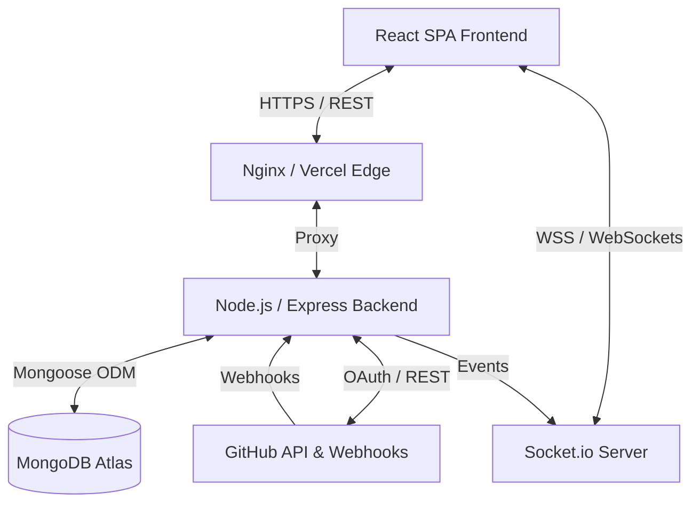
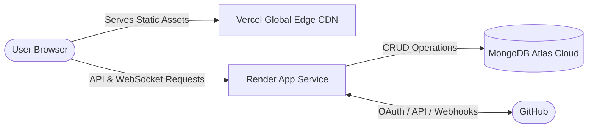
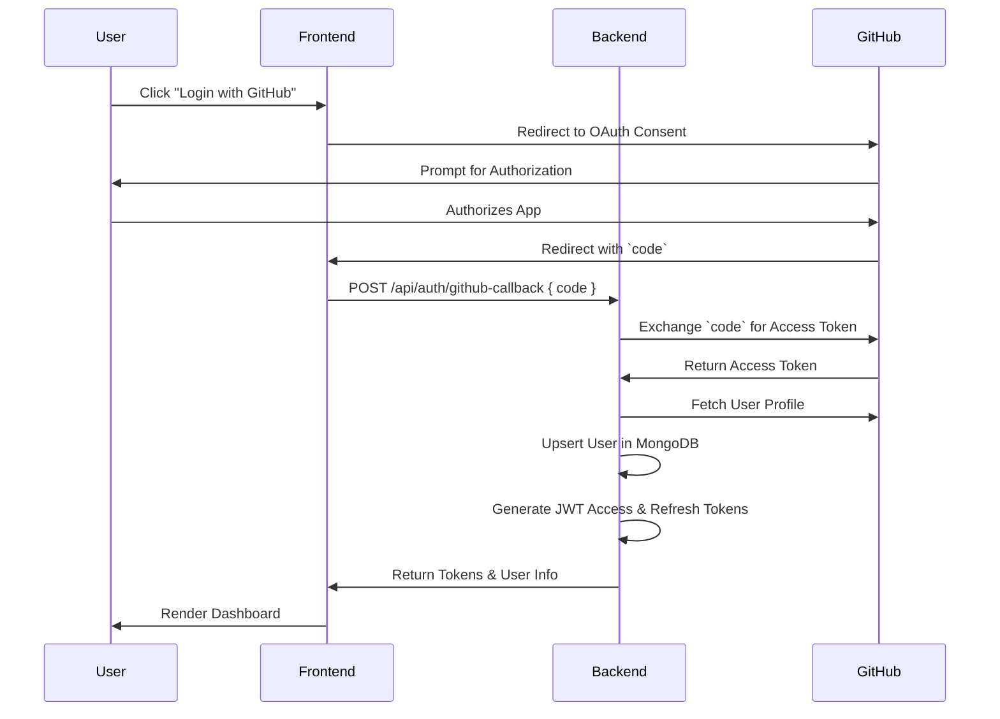
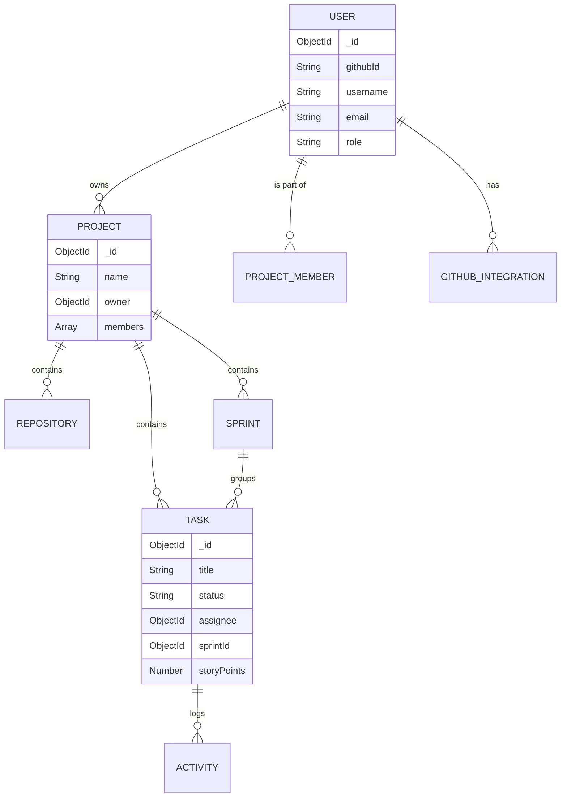
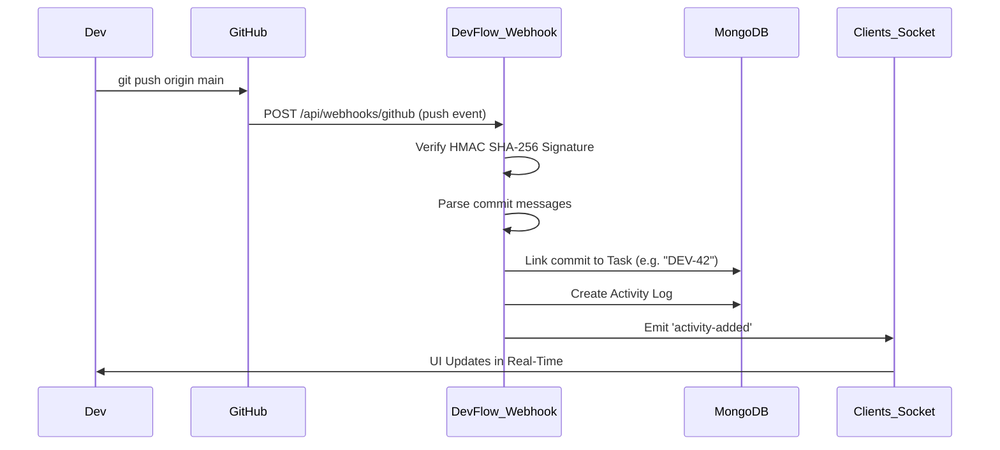
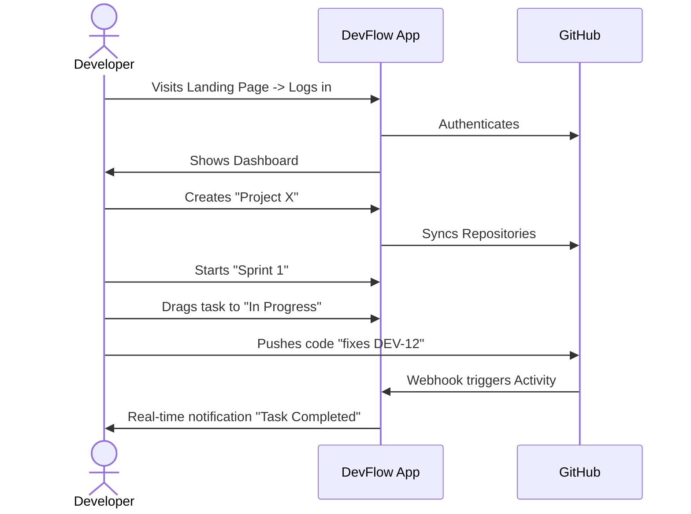

<div align="center">
  <h1> DevFlow</h1>
  <p><strong>GitHub Integrated Sprint & Project Management System</strong></p>
  <p>A modern, real-time, collaborative project management platform designed specifically for software development teams.</p>

  [](https://nodejs.org/)
  [](https://react.dev/)
  [](https://www.mongodb.com/)
  [](https://socket.io/)
  [](https://github.com/)
  [](LICENSE)
</div>

<hr />

## 📖 Table of Contents
1. [Project Overview](#1-project-overview)
2. [System Architecture](#2-system-architecture)
3. [Complete Feature Breakdown](#3-complete-feature-breakdown)
4. [Authentication & Authorization](#4-authentication--authorization)
5. [Database Design](#5-database-design)
6. [API Documentation](#6-api-documentation)
7. [GitHub Integration Flow](#7-github-integration-flow)
8. [Sprint & Kanban Workflow](#8-sprint--kanban-workflow)
9. [Real-Time Features](#9-real-time-features)
10. [Security Architecture](#10-security-architecture)
11. [Scalability Considerations](#11-scalability-considerations)
12. [Folder Structure Deep Dive](#12-folder-structure-deep-dive)
13. [Design Patterns Used](#13-design-patterns-used)
14. [Error Handling Strategy](#14-error-handling-strategy)
15. [Performance Optimization](#15-performance-optimization)
16. [CI/CD & Deployment](#16-cicd--deployment)
17. [Testing Strategy](#17-testing-strategy)
18. [Complete User Journey](#18-complete-user-journey)
19. [Interview Preparation Section](#19-interview-preparation-section)
20. [Future Enhancements](#20-future-enhancements)
21. [Lessons Learned](#21-lessons-learned)
22. [Resume & Portfolio Explanation](#22-resume--portfolio-explanation)

---

## 1. Project Overview

### Project Introduction
DevFlow is a production-grade, full-stack SaaS application that merges Agile project management (like Jira and Linear) with deep GitHub integration. It allows engineering teams to plan sprints, track tasks on a Kanban board, and automatically sync commits, pull requests, and issues from GitHub—all in real-time.

### Real-World Problem Statement
Software teams often use separate tools for code hosting (GitHub) and task management (Jira, Trello). This fragmentation forces developers to constantly switch context, manually update ticket statuses, and struggle to link code changes back to business requirements. 

### Target Users
- **Software Engineers:** Need a seamless way to link code to tasks without leaving their workflow.
- **Scrum Masters/Project Managers:** Need visibility into sprint velocity, team workload, and real-time project health.
- **Engineering Managers/CTOs:** Need analytics on team productivity and cycle times.

### Business Value
- **Increased Productivity:** Automates task tracking via GitHub Webhooks, saving hours of manual updates.
- **Single Source of Truth:** Unifies code activity and sprint planning in one dashboard.
- **Enhanced Collaboration:** Real-time WebSocket updates keep remote teams instantly synchronized.

### Key Objectives
1. Build a robust, scalable MERN stack application with real-time capabilities.
2. Implement seamless GitHub OAuth and webhook integrations.
3. Deliver a buttery-smooth, drag-and-drop Kanban experience.
4. Provide comprehensive productivity analytics and burndown charts.

### Why this project is different from competitors
Unlike generic task managers, DevFlow is *code-aware*. It natively understands Git commits, pull requests, and releases, linking them to tasks automatically while providing a modern, developer-centric UI with dark mode and glassmorphism.

---

## 2. System Architecture

DevFlow is built on the **MERN** stack (MongoDB, Express, React, Node.js) but extended with **Socket.io** for real-time capabilities and **Redis** (optional caching layer) for performance.

### High-Level Architecture Diagram



### Component Architecture
- **Frontend Layer:** React 19, Vite, React Router, TanStack Query (React Query) for state management, Tailwind CSS + Shadcn UI for styling.
- **Backend Layer:** Node.js, Express.js. Structured using controllers, services, middlewares, and routers.
- **Database Layer:** MongoDB Atlas with Mongoose schemas featuring robust indexing.
- **Integration Layer:** GitHub OAuth 2.0, GitHub REST API octokit wrapper, and secure webhook listener.
- **Real-Time Layer:** Socket.io managing rooms based on `projectId` for targeted event broadcasting.

### Deployment Diagram



---

## 3. Complete Feature Breakdown

### A. Authentication & GitHub OAuth
- **Purpose:** Secure platform access and GitHub integration.
- **User Flow:** User clicks "Login with GitHub" -> Redirected to GitHub consent -> Redirected back to `/oauth/callback` -> Dashboard.
- **Backend Flow:** Exchanges code for access token -> Fetches GitHub profile -> Upserts User document -> Generates JWT Access & Refresh tokens.
- **Security:** HTTP-only cookies for refresh tokens, short-lived JWT access tokens, CSRF mitigation.

### B. Project & Team Management
- **Purpose:** Organize workspaces and manage access control.
- **User Flow:** User creates a project, invites members by email/username, and assigns roles (Owner, Scrum Master, Developer, Viewer).
- **Backend Flow:** Creates Project document -> Links members -> Broadcasts `project-updated` socket event.
- **Security:** RBAC middleware checks if the user has required permissions before executing mutations.

### C. Sprint Management
- **Purpose:** Agile iteration planning.
- **User Flow:** Create a sprint with start/end dates -> Add goals -> Start sprint -> Monitor burndown -> Complete sprint.
- **Database:** `Sprints` collection with calculated `velocity` and `status` (PLANNED, ACTIVE, COMPLETED).

### D. Kanban Board
- **Purpose:** Visual task management.
- **User Flow:** Drag tasks between columns (Backlog, Todo, In Progress, Review, Done).
- **Backend Flow:** Updates task status -> Triggers activity log -> Emits socket event to all project members.
- **Edge Cases:** Conflicting simultaneous drags are resolved using optimistic UI updates with server-side timestamp validation.

### E. GitHub Activity Sync & Webhooks
- **Purpose:** Keep the board updated with code changes.
- **Backend Flow:** GitHub sends `push` event -> Backend verifies HMAC signature -> Finds linked task via commit message (e.g., "Fixes DEV-123") -> Adds Activity Log -> Emits socket event.

### F. Analytics Dashboard
- **Purpose:** Provide actionable insights.
- **User Flow:** View burndown charts, productivity matrix, and PR trends.
- **Backend Flow:** MongoDB Aggregation pipelines process thousands of tasks/activities to calculate real-time metrics.

---

## 4. Authentication & Authorization

### Authentication Flow (OAuth 2.0 + JWT)



### Role-Based Access Control (RBAC)
- **OWNER:** Full access. Can delete project, manage integrations, remove users.
- **SCRUM_MASTER:** Can manage sprints, assign tasks, edit board settings.
- **DEVELOPER:** Can update assigned tasks, move tasks on the board, view projects.
- **VIEWER:** Read-only access to boards and analytics.

**Security Mechanisms:**
- Password hashing using bcrypt (if local auth added).
- Token rotation using Refresh Tokens stored in secure HTTP-Only cookies.
- Middleware validates JWT on every protected route.

---

## 5. Database Design

### ER Diagram



### Indexing & Optimization
- **Tasks Collection:** Compound index on `{ projectId: 1, sprintId: 1, status: 1 }` for blazing fast Kanban board loading.
- **Activities Collection:** TTL index (optional) or index on `{ projectId: 1, createdAt: -1 }` for fast activity feed retrieval.

---

## 6. API Documentation

DevFlow exposes a RESTful API. Below are key examples.

### Tasks API
**`GET /api/v1/projects/:projectId/tasks`**
- **Purpose:** Fetch tasks for the Kanban board.
- **Auth:** Bearer Token (JWT).
- **Response:**
  ```json
  {
    "status": "success",
    "data": [
      {
        "_id": "60d5ec...",
        "title": "Implement Login",
        "status": "TODO",
        "assignee": { "username": "johndoe", "avatar": "..." }
      }
    ]
  }
  ```

**`PATCH /api/v1/tasks/:taskId/status`**
- **Purpose:** Update task column (Drag & Drop).
- **Request Body:** `{ "status": "IN_PROGRESS" }`
- **Validation:** Zod schema ensures status is one of `[BACKLOG, TODO, IN_PROGRESS, REVIEW, DONE]`.

---

## 7. GitHub Integration Flow

DevFlow deeply integrates with GitHub to provide seamless workflow automation.



**Security Consideration:** All webhooks validate the `X-Hub-Signature-256` header against the stored Webhook Secret to prevent spoofed payloads.

---

## 8. Sprint & Kanban Workflow

The Kanban implementation uses `@hello-pangea/dnd`. 

**State Transitions:**
`BACKLOG` ➡️ `TODO` ➡️ `IN_PROGRESS` ➡️ `REVIEW` ➡️ `DONE`

**Calculations:**
- **Sprint Velocity:** Sum of completed story points in a sprint.
- **Burndown:** Plotted by mapping expected completion trajectory vs. actual `DONE` transitions logged in the Activity table.

---

## 9. Real-Time Features

DevFlow uses **Socket.io** for real-time, optimistic UI updates.

### Connection Lifecycle
1. User connects to socket passing JWT token in auth payload.
2. Server verifies token, socket joins `project_${projectId}` room.
3. Event fired (e.g., Task Moved).
4. Server processes DB update -> Emits `task-updated` to `project_${projectId}`.
5. React Query invalidates/updates cache instantly.

---

## 10. Security Architecture

Security is baked in at every layer:
- **Helmet.js:** Secures Express apps by setting various HTTP headers (XSS Filter, HSTS, NoSniff).
- **Express Rate Limit:** Prevents brute-force API attacks.
- **Mongo Sanitize:** Prevents NoSQL injection attacks by stripping `$` operators.
- **JWT Integrity:** Tokens are signed with HS256. Short expirations minimize token theft impact.
- **CORS:** Strictly configured to allow only the Vercel frontend domain.

---

## 11. Scalability Considerations

- **Horizontal Scaling:** The Node backend is stateless. JWTs and GitHub tokens are stored in the DB, allowing multiple Node.js instances to run behind a Load Balancer. Socket.io requires a Redis Adapter if scaled to multiple instances.
- **Database Scaling:** MongoDB Atlas allows instant vertical scaling and automatic sharding as data grows.
- **Caching Strategy:** Frequently accessed data (like Project Members) can be cached in Redis to reduce DB load.

---

## 12. Folder Structure Deep Dive

```text
DevFlow/
├── backend/
│   ├── controllers/      # Route logic & request handling
│   ├── middlewares/      # Auth, Error handling, Validation
│   ├── models/           # Mongoose schemas (User, Task, Project)
│   ├── routes/           # Express router definitions
│   ├── services/         # Business logic & GitHub API wrappers
│   ├── utils/            # Helpers, Custom Error classes
│   └── server.js         # Entry point
└── frontend/
    ├── src/
    │   ├── components/   # Reusable UI components (Shadcn)
    │   ├── context/      # React Context (Auth, Socket)
    │   ├── hooks/        # Custom React Query hooks
    │   ├── pages/        # Route views (Dashboard, Kanban)
    │   ├── services/     # Axios API calls
    │   └── utils/        # Formatters, constants
    └── vite.config.js    # Build configuration
```

---

## 13. Design Patterns Used

- **MVC (Model-View-Controller):** Standardized routing and separation of concerns.
- **Service Layer Pattern:** Business logic is abstracted into `services/` (e.g., `githubService.js`) so controllers stay lean and testable.
- **Observer Pattern:** Socket.io implements this to broadcast state changes.
- **Repository Pattern (Implicit):** Mongoose acts as the repository, abstracting raw MongoDB queries.

---

## 14. Error Handling Strategy

- **Backend:** A global `errorHandler` middleware catches all synchronous and asynchronous errors. Custom `AppError` class specifies HTTP status codes.
- **Frontend:** React Error Boundaries prevent complete app crashes. Axios interceptors globally catch 401/403 errors and trigger the token refresh flow or logout.

---

## 15. Performance Optimization

- **Database:** Aggregation pipelines handle complex data joining inside Mongo rather than Node memory. Proper indexing on `projectId`.
- **Frontend:** React Query heavily caches GET requests. Route-based code splitting using `React.lazy()` reduces initial bundle size. 
- **Rendering:** Debouncing search inputs. Virtualization for massive activity feeds.

---

## 16. CI/CD & Deployment

### Build Process
We use GitHub Actions for Continuous Integration.
1. Linting (`ESLint`).
2. Type-checking / Tests.
3. Build Vite bundle.
4. Build Docker container.

### Deployment Architecture
- **Frontend:** Auto-deployed to Vercel upon push to `main`.
- **Backend:** Deployed to Render via Docker container.
- **DB:** MongoDB Atlas cluster.

---

## 17. Testing Strategy

- **Unit Testing:** Jest & Supertest for isolated backend controllers and utility functions.
- **API Testing:** Postman collections testing auth, validation, and CRUD.
- **Frontend Testing:** React Testing Library for component rendering and user event simulation.

---

## 18. Complete User Journey



---

## 19. Interview Preparation Section

This section helps developers prepare to defend this architecture in interviews.

### Beginner Questions
**Q: How does React Query differ from Redux?**
*A:* Redux is for global client state management, requiring heavy boilerplate. React Query is designed specifically for asynchronous server state—it handles caching, refetching, and loading states out of the box.

**Q: What is a JWT and how is it used here?**
*A:* A JSON Web Token is a compact, URL-safe means of representing claims. We use it to authenticate API requests statelessly without storing sessions in the DB.

### Intermediate Questions
**Q: How does the drag-and-drop feature actually persist data?**
*A:* When a drag ends, the frontend optimistic UI updates instantly. Simultaneously, a PATCH request is sent to the backend. The backend updates the DB, creates an activity log, and emits a socket event. If the API fails, the frontend rolls back the optimistic update.

**Q: Explain how you prevent race conditions in Socket.io.**
*A:* Socket events carry timestamps. If a client receives a `task-updated` event but their local state is newer (due to optimistic UI), they ignore the socket event.

### Advanced System Design Questions
**Q: How would you scale the WebSocket server if traffic 10x's?**
*A:* Node.js is single-threaded. To scale websockets, we run multiple Node instances behind a load balancer with sticky sessions enabled. We must implement the **Redis Adapter** for Socket.io so events emitted on Node Instance A can be broadcast to clients connected to Node Instance B.

**Q: Why use MongoDB over PostgreSQL for this app?**
*A:* Project management data often requires flexible schema (e.g., custom task fields, varying GitHub webhook payloads). MongoDB's document model allows rapid iteration, and its Aggregation Framework is extremely powerful for generating our Analytics dashboards.

### Architecture Decision Questions
**Q: Why GitHub OAuth instead of standard Email/Password?**
*A:* Our target audience is developers. Forcing them to create a new password adds friction. More importantly, we need OAuth permissions to access their repositories, webhooks, and commits to fulfill the core value proposition of the app.

### Security Questions
**Q: How do you secure Webhooks from being spoofed?**
*A:* We configure a secret in GitHub. GitHub signs the payload using HMAC SHA-256 and sends it in the `X-Hub-Signature-256` header. Our Node backend hashes the raw request body with our secret and compares it. If they match, the request is authentic.

### Scalability Questions
**Q: How do you handle millions of Activity Log entries?**
*A:* We implement pagination (cursor-based or limit/offset). For storage, we can use MongoDB Time Series collections or TTL indexes to archive logs older than 90 days.

### Project Defense Pitch (30 Seconds)
*"I built DevFlow, a full-stack real-time Agile project management tool. It's built on the MERN stack with Socket.io. It solves the context-switching problem for developers by integrating deeply with GitHub—using Webhooks to auto-update tasks when code is pushed. I architected the system to handle real-time concurrency, secure OAuth flows, and complex MongoDB aggregations for analytics."*

---

## 20. Future Enhancements
- **Short-Term:** Slack/Discord integrations for notifications.
- **Long-Term:** Custom issue workflows and custom fields.
- **Enterprise:** SAML SSO integration, on-premise deployment options.
- **AI-Powered:** Auto-generating task descriptions from code diffs using LLMs.

---

## 21. Lessons Learned
- **Architectural Trade-offs:** Storing too much data in JWTs can bloat headers. Kept JWTs lean (just user ID and role) and fetched full profile via React Query.
- **Mistakes Avoided:** Initializing Socket.io without namespaces/rooms caused global broadcasting of sensitive project data. Refactored to strictly use `projectId` rooms.
- **Key Takeaway:** Designing robust database schemas upfront (especially relations between Sprints, Tasks, and Activities) saves massive refactoring time later.

---

## 22. Resume & Portfolio Explanation

**Add this to your Resume:**
> **DevFlow - Real-time Project Management Platform** | *React, Node.js, MongoDB, Socket.io, GitHub API*
> - Architected and developed a full-stack SaaS application for Agile sprint planning and Kanban task management.
> - Engineered deep GitHub integration utilizing OAuth 2.0 and Webhooks (HMAC SHA-256 validation) to automate task status transitions based on Git commits.
> - Implemented real-time collaboration using Socket.io and React Query optimistic updates, reducing data staleness to zero.
> - Designed complex MongoDB aggregation pipelines to power a real-time analytics dashboard tracking sprint burndown and developer velocity.

<hr/>

<div align="center">
  <i>Built with passion by a Senior Full Stack Engineer.</i>
</div>
